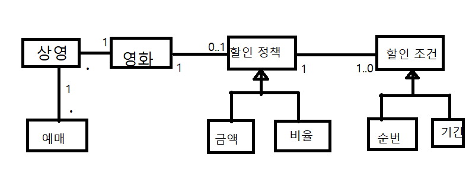

# 객체 설계

## 예제

### 온라인 영화 예메시스템

- :leaves:  각 액터
- 영화
    - 제목
    - 상영시간
    - 가격
- 상영시간
    - 상영일자
    - 상영시간
    - 순번 (회차)

<details>
<summary style="color: orange">상영과 영화로 구분 하는 이유</summary>
> 상영과 영화로 구분 하는 이유 사용자가 실제로 예매하는 대상은 영화가 아닌 상영이기 때문이다.
> 영화를 예매한다고 표현하지만 실제로는 특정 시간에 상영되는 영화를 관람할 수 있는 권리를 구매하기 위해 돈을 지불하기 때문.
</details>

|영화 선택| 관람일 선택 | 시간 선택 |
|-------|------------|---------|
아바타|   2019 년 12월 | 1회 06:00
타이타닉|  1 2 3 4 5 6 7 | 2회 08:00
스타워즈| 8 9 10 11 12 13 14 | 3회 10:00
호리의 시간은 거꾸로간다| 15 16 17 18 19 20 21 | 4회 12:00
영훈님의 이직 : 더 비기닝| 22 23 24 25 26 27 28  | 5회 14:00
사악한 보름이의 지구정복 | 29 30 31 | 6회 16:00

- 특정한 조건을 만족하는 예매자 요금 할인
    - 할인 조건 (discount condition)
        - 순서 조건 (sequence condition)<br>
          상영 순번을 이용해 할인 여부를 결정하는 규칙
        - 기간 조건 (period condition)<br>
          영화 상영 시작시간을 이용해 할인 여부를 결정한다.
            1. 요일<br>
            2. 시작시간
            3. 종료시간<br>
               시작시간이 해당 기간 안에 포함될 경우 할인.<br>
               ex) 월요일, 시작 시간이 오전 10시, 종료 시간이 오후 1시인 기간 조건을 사용

    - 할일 정책 (discount policy)
        - 금액 할인 정책 (amount discount policy)
        - 비율 할인 정책 (percent discount policy)<br><br>
          영화별로 하나의 할인 정책만 적용 가능.<br>
          할인 조건은 다수의 할인 조건을 지정 할 수 있다.

<table>
<thead>
<th>영화</th>
<th>할인 정책</th>
<th>할인 조건</th>
</thead>
<tbody class="avatar">
<tr>
<td rowspan="4" >아바타</td>
<td rowspan="4" >금액할인정책<br>(할인액:800원)</td>
<td><b style="color:green">순번 조건</b><br> 조조 상영</td>
</tr>
<tr>
<td><b style="color:green">순번 조건</b><br> 10회차 상영</td>
</tr>
<tr>
<td><b style="color:orange">기간 조건</b><br> 월요일 10:00~ 12:00 사이 상영 시작</td>
</tr>
<tr>
<td><b style="color:orange">기간 조건</b><br> 목요일 18:00~ 21:00 사이 상영 시작</td>
</tr>
</tbody>
<tbody class="titanic">
<tr>
<td rowspan="3" >타이타닉</td>
<td rowspan="3" >비율할인정책<br>(할인율 : 10%)</td>
<td><b style="color:green">기간 조건</b><br> 화요일 14:00~ 17:00 사이 상영 시작</td>
</tr>
<tr>
<td><b style="color:green">순번 조건</b><br> 2회차 상영</td>
</tr>
<tr>
<td><b style="color:orange">기간 조건</b><br> 목요일 10:00~ 14:00 사이 상영 시작</td>
</tr>
</tbody>
<tbody class="starwars">
<tr>
<td>스타워즈: 깨어난 포스<br>(가격 :10,000원)</td>
<td>없음</td>
<td>없음</td>
</tr>
</tbody>
</table>

1. 사용자의 예메 정보가 할인 조건 중 하나라도 만족하는지 검사한다.
  - 조건을 만족할 경우 할인 정책을 이용해 할인 요금을 계산.
  - 할인조건을 만족하지 못하는 경우 아예 요금을 할인 하지 않는다.
<details><summary style="color: orange">할인 예시</summary>
> ex:  사용자가 '아바타'를 예매한다고 가정하면, 이 영화에는 800원의 금액 할인정책이 적용되어 있따.<br>
> 사용자의 예매 정보가 할인 조건을 만족할 경우 1인당 800원의 요금을 할인해줘야 한다.
> 아바타의 할인 조건은 두개의 수번 조건 (조조, 10회차)과 두개의 기간 조건 (월요일 10시에서 12시 사이에 시작, 목요일 18시에서 21 사이에 시작)으로 구성되어 있다.<br>
> 이 조건을 만족하는 영화를 예매할 경우 원래 가격인 10,000원에서 할인 요금인 800원만큼 할인 받을 수 있기 때문에 사용자는 9,200원에 영화를 예매할 수 있다.
> 할인 정책은 1인을 기준으로 책정되기 때문에 예약 인원이 두명이라면 1,600원의 요금을 할인 받을 수 있다.
> 예매를 완료하면 다음과 같은 예매 정보를 생성해야 한다.

|제목|아바타|
|---|-----|
|상영정보|2019년 12월 26일(목)<br> 7회 6:00 (오후) - 8:00(오후)|
|인원|2명|
|정가|20,000원|
|결제 금액| 18,400원|
</details>

## 객체지향 프로그래밍을 향해 
### 협력, 객체, 클래스
 - 어떤 클래스가 필요한지 그리고 어떤 속성과 메서드가 필요한지 고민하지만 이것은 객체지향의 본질과는 거리가 멀다.<br>
  <b><u> 클래스보다 객체에 초점을 맞추어야 한다.</u></b>
 -  객체지향 프로그래밍시 집중 해야하는 두 가지
    1. <b>어떤 클래스가 필요한지를 고민하기 전에 어떤 객체들이 필요한지 고민하라.</b><br>클래스는 공통적인 상태와 행동을 공유하는 객체들을 추상화한 것이다.<br>
    클래스의 윤곽을 잡기 위해서는 어떤 객체들이 어떤 상태와 행동을 가지는지를 먼저 결정해야 한다.<br>
    객체를 중심에 두는 접근 방법은 설계를 단순하고 깔끔하게 만든다.<br><br>
    2. 객체를 독립적인 존재가 아니라 기능을 구현하기 위해 협력하는 공동체의 일원으로 봐야 한다.<br>
    객체는 홀로 존재하는 것이 아닌, 다른 객체에게 도움을 주거나 의존하면서 살아가는 협력적인 존재다.<br>
       
### 도메인의 구조를 따르는 프그램 구조
- 도메인(Domain)?<br>
문제를 해결 하기 위해 사용자가 프로그램을 사용하는 분야를 <b>도메인</b>이라고 부른다.
  - 소프트웨어는 사용자가 원하는 어떤 문제를 해결하기 위해 만들어진다. <br>
    영화 예메 시스템의 목적은 영화를 좀 더 쉽고 빠르게 예매하려는 사용자의 문제를 해결하는 것이다.
    
- 객체지향 패러다임이 강력한 이유는 <br>
요구사항을 분석하는 초기 단계부터 프로그램을 구현하는 마지막 단계까지 객체라는 동일한 추상화 기법을 사용할 수 있기 때문이다.<br>
요구사항과 프로그램을 객체라는 동일한 관점에서 바라볼 수 있기 때문에 도메인을 구성하는 개념들이 프로그램의 객체와 클래스로 매끄럽게 연결 될 수 있다.

  - 여러번 상영 될 수 있고 상영은 여러 번 예매될 수 있다.<BR> 
  - 할인 정책을 할당하지 않거나 할당하더라도 오직 하나만 할당할 수 있고,<BR>
  - 할인 정책이 존재하는 경우에는 하나 이상의 할인 조건이 반드시 존재한다는 것을 알 수 있다.<BR>
  - 할인 정책의 종류로는 금액 할인 정책과 비율 할인 정책이 있고,<BR>
  - 할인 조건의 종류로는 "순번 조건"과 "기간 조건"이 있다는 사실을 위에 도식에서 알 수 있다.<BR><BR>
- 일반적으로 클래스의 이름은 대응되는 도메인 개념의 이름과 동일하거나 적어도 유사하게 지어야 한다.<BR>
- 클래스 사이의 관계도 최대한 도메인 개념 사이에 맺어진 관계와 유사하게 만들어서 프로그램 구조를 이해하고 예상하기 쉽게 만들어야 한다.
  - 이 원칙에 따라 <BR>
    영화 라는 개념은 `Movie` <br>
    상영 이라는 개념은 `Screening`<br>
    할인 정책은 `DiscountPolicy` <br>
    금액 할인 정책은 `AmountDiscountPolicy`<br>
    비율 할인 정책은 `PercentDiscountPolicy`<br>
    순번 조건은 `SequenceCondition`<br>
    기간 조건은 `PeriodCondition`<br>
    예매는 `Resevation`으로 각각 이름으로 지어진 클래스로 구현한다.
    
### 클래스 구현하기
1. `Screening` 클래스는 사용자들이 예매하는 대상인 '상영을' 구현하고,<br>
   다음을 인스턴스 변수로 포함한다.
  - 영화(movie)
  - 순번 (sequence)
  - 상영 시작 시간 (whenScreened)<br>

상영 시작 시간을 반환하는 메서드 `getStartTime` 메서드<br>
순번의 일치 여부를 검사하는 `isSequence`메서드<br>
기본 요금을 반환하는 `getMovieFee`메서드를 포함한다.
```java
package com.moon.movieReserver;

import java.time.LocalDateTime;

public class Screening {
    private Movie movie;
    private int sequence;
    private LocalDateTime whenScreened;

    public Screening(Movie movie, int sequence, LocalDateTime whenScreened) {
        this.movie = movie;
        this.sequence = sequence;
        this.whenScreened = whenScreened;
    }

    public LocalDateTime getStartedTime(){
        return whenScreened;
    }

    public boolean isSequence(int sequence){
        return this.sequence == sequence;
    }

    public Money getMovieFee() {
        return movie.getFee;
    }
}
```
- 여기서 주목할 점은<br>
  인스턴스 변수의 가시성은 `private`, <br>
  메서드의 가시성은 `public`이라는 것.<br><br>
  클래스를 구현하거나 다른 개발자에 의해 개발된 클래스를 사용할 때 가장 중요한 것은 클래스의 경계를 구분 짓는 것이다.<br>
  클래스는 내부와 외부로 구분되며 훌륭한 클래스를 설계하기 위해 핵심은 어떤 부분을 외부에 공개하고, 어떤 부분을 감출지를 결정하는 것이다.<br><br>
  <b>외보에서 객체의 속성에 직접 접근할 수 없도록 막고, <br>
  적절한 `public`메서드를 통해서만 내부 상태를 변경할 수 있게 해야만 한다.</b><br><br>
  
- 클래스의 내부와 외부를 구분해야 하는 이유는 무엇인가?<br>
  그 이유는 경계의 명확성이 객체의 자율성을 보장하기 때문.
  - 프로그래머에게 구현의 자유를 제공하기 때문이다.
    
#### 자율적인 객체
 1. 객체가 상태(state)와  행동(behavior)를 함께 가지는 복합적인 존재라는 것.
 2.  사실은 객체가 스스로 판단하고 행동하는 자율적인 존재라는 것이다.<br><br>
- 많은 사람들은 객체를 상태와 행동을 함께 포함하는 식별 가능한 단위로 정의한다.<br>
객체지향 이전의 패러다임에서는 데이터와 기능이라는 독립적인 존재를 서로 엮어 프로그램을 구성했지만,<br>
  객체지향은 객체라는 단위 안에 데이터와 기능을 한 덩어리로 묶음으로써 문제 영역의 아이디어를 적절하게 표현할 수 있게 했다.<br><br>
  이처럼 데이터와 기능을 객체 내부로 함께 묶는 것을 <b>캡슐화</b>라고 한다.<br><br>
  
- 객체지향 프로그래밍 언어들은 상태와 행동을 캡슐화 하는 것에서 나아가 <br>
  외부에서 접근을 통제 할수 있는 <b>접근 제어(access control) 도 제공한다.</b><br><br>
  이를 위해 `public`, `protected`, `private`와 같은 <b> 접근 수정자(access modifier)</b>도 제공한다.<br><br>
  
객체 내부에 대한 접근을 통제하는 이유는 객체를 자율적인 존재로 만들기 위해서이다.<br>
객체지향의 핵심은 스스로 상태를 관리하고, 판단하고, 행동하는 자율적인 객체들의 공동체를 구성하는 것이다.< br>
객체가 자율적인 존재로 우뚝 서기 위해서는 외부의 간섭을 최소화해야 한다.<br>
외부에서는 객체가 어떤 상태에 놓여있는지, 어떤 생각을 하고 있는지 알아서는 안되며,<br>
결정에 직접적으로 갱비하려고 해서도 안된다.<br>
객체에게 원하는 것을 요청하고는 객체가 스스로 처ㅣ선의 방법을 결정할 수 있을것이라는 점을 믿고 기다려야 한다.
<br>

- 캡슐화와 접근 제어는 객체를 두 부분으로 나눈다.
 - 외부에서 접근 가능한 부분으로 이를 <b>퍼블릭 인터페이스</b> 라고 부른다.
 - 외부에서 접근 불가능하고 오직 내부에서만 접근 가능한 부분으로 이를 <b>구현(implement)</b>라고 브른다.
 - 인터페이스와 구현의 원리(separation of interface and implementation)원칙은 훌륭한 객체지향 프로그램의 핵심 원칙이다.<br><br>
일반적으로 객체의 상태는 숨기고 행동만 외부에 공개해야 한다.<br>
   외부에 공개는 `public` 숨기는 것은 `private`를 서브클래스나 내부ㅠ에서만 접근 가능해야 한다면 가시성을 `protected` `private`로 지정해야 한다.
   - 퍼블릭 인터페이스는  `public`으로 지정된 메서드만 포함된다.
   - 그 밖의 `private `이나 `protected` 메서드, 속성은 구현에 포함 된다.
    
### 프로그래머의 자유
- 클래스 작성자( class creator)와 클라이언트 프로그래머 (client programmer)로 구분 하는 것이 유용하다.<br><br>
새로운 데이터 타입을 프로그램에 추가하고, 클라이언트 프로그래머는 클래스 작성자가 추가한 데이터 타입을 사용한다.
  
- 클라이언트 프로그래머의 목표는 필요한 클래스들을 엮어서 어플리케이션을 빠르고 안정적으로 구축하는 것이다.<br>
- 클래스 작성자는 클라이언트 프로그래머에게 필요한 부분만 공개하고 나머지는 꽁꽁 숨겨야 한다.<br>
클라이언트 프로그래머가 숨겨 놓은 부분에 마음대로 접근할 수 없도록 방지함으로써 클라이언트 프로그래머에 대한 영향을 걱정하지 않고도 내부 구현을 마음대로 변경할 수 있다.<br>
  이를 <b>구현 은닉(implementation hiding)이라고 부른다.</b><br><br>
  
- 접근 제어 메카니즘은 프로그래밍 언어 차원에서 클래스의 내부와 외부를 명확하게 경계 지을 수 있게 하는 동시에 클래스 작성자가 내부 구현을 은닉할 수 있게 해준다.<br>
클러이언트 프로그래머가 술수로 숨겨진 부분에 접근하는 것을 막아준다.<br>
  클라이언트 프로그래머가 `private`속성이나 메서드에 접근 하려고 시도하면 컴파일러는 오류를 뱉어줄 것이다.<br><br>
  
- 구현 은닉 <br>
 클래스 작성자와 클라이언트 프로그래머 모두에 유용한 개념이다.<br>
  클라이언트 프로그래머는 내부의 구현은 무시한 채 인터페이스만 알고 있어도 클래스를 사용할 수 있기 때문에 머리속에 담아둬야하는 지식의 양을 줄일 수 있다.<br>
  클래스 작성자는 인터페이스를 바꾸지 않는 한 외부에 미치는 영향을 걱정하지 않고도 내부 구현을 마음대로 변경할 수 있다.<br>
  `public`영역을 변경하지 않는다면 코드를 자유롭게 수정할 수 있다는 것이다.
  <br><br>
- 설꼐가 필요한 이유는 변경을 관리하기 위해서 라는 것.
- 객체지향 언어는 객체 사이의 의존성을 적절히 관리함으로써 변경에 대한 파급효과를 제어할 수 잇는 다양한 방법을 제공한다.<br>
객체의 변경을 관리 할 수 있는 기법 중에서 가장 대표적인 것이 접근제어이다.
  
###  협려갛는 객체들의 공동체
```java

public class Screening {
    private Movie movie;
    private int sequence;
    private LocalDateTime whenScreened;

    public Reservation reserve(Customer customer, int audienceCount) {
        return new Reservation(customer, this, calculateFee(audienceCount), audienceCount);
    }
}
```
`Screening`의  `reserve` 메서드를 보면 `calculateFee` 라는 `private`메서드를 호출해서 요금을 호출해서 욕므을 계산한 후 그 결과를 `Reservation`의 생성자에 전달하는 것을 알 수 있다.<br>
`calculateFee`메서드는 요금을 계산하기 위해 다시 `Movie`의  `calculateMovieFee` 메서드를 호출한다.<br>
`Movie` 의 `calculateMoiveFee`메서드의 반환 값은 1인당 예매 요금이다.<br>
띠라서  `Screening `은 전체 예매 요금을 구하기 위해`calculateMovieFee`메서드의 반환값에 인원 수인  `audienceCount`를 곱한다.<br>
```java
public class Screening {
    private Movie movie;
    private int sequence;
    private LocalDateTime whenScreened;

    private Money calculateFee(int audienceCount) {
        return movie.calculateMovieFee(this).times(audienceCount);
    }
}
```
- Money 는 금액과 관련된 다양한 계산을 구현하는 간단한 클래스다.<br>

```java
package com.moon.movieReserver;


import java.math.BigDecimal;

public class Money {
    public static final Money Zero = Money.wons(0);

    private final BigDecimal amount;

    public  static Money wons(long amount){
        return new Money(BigDecimal.valueOf(amount));
    }

    public static Money wons(double amount){
        return new Money(BigDecimal.valueOf(amount));
    }

    Money (BigDecimal amount){
        this.amount = amount;
    }

    public Money plus(Money amount){
        return new Money(this.amount.add(amount.amount));
    }

    public Money minus(Money amount){
        return new Money(this.amount.subtract(amount.amount));
    }

    public Money times(double percent){
        return new Money(this.amount.multiply(
                BigDecimal.valueOf(percent)
        ));
    }

    public boolean isLessThan(Money other){
        return amount.compareTo(other.amount)<0;
    }

    public boolean isGreaterTanOrEqual(Money other){
        return amount.compareTo(other.amount) >= 0;
    }
}

```
- 1 장에서는 금액을 구현하기 위해 `Long`타입을 사용 했다. <Br>
`Long`타입은 변수의 크기나 연산자의 종류와 곤련된 구현 관점의 제약은 표현할 수 있지만,
  `Money`타입처럼 저장하는 값이 금액과 관련돼 있다는 의미를 전달할 수는 없다.<br>
  또한, 금액과 관련된 로직이 서로 다른 곳에 중복되어 구현되는 것을 막을 수 없다.<br><br>
  객체지향의 장점은 객체를 이용해 도메인의 의미를 풍부하게 할수 있다는 것이다.<br><br>
  의미를 좀 더 명시적이고 분명하게 표현할 수 있따면 객체를 사용해서 해당 개념을 구현해야한다.<br>
  그 개념이 비록 하나의 인스턴스 분셔만 포함하더라도 개념을 명시적으로 표현하는 것은 전체적인 설계와 명확성과 유연성을 높이는 첫걸음이다.
  <br>
  `Reservation` 클래스는 고객 (customer), 상영 정보(screening), 예매 요금(fee), 인원 수 (audienceCount) 를 속성으로 포함한다.<Br>
  
```java
package com.moon.movieReserver;

public class Reservation {

    private Customer customer;
    private Screening screening;
    private  Money fee;
    private int audienceCount;

    public Reservation(Customer customer, Screening screening, Money fee, int audienceCount) {
        this.customer = customer;
        this.screening = screening;
        this.fee = fee;
        this.audienceCount = audienceCount;
    }
}

```
영화를 예마히기 위해, `Screening`,`Movie`,`Reservation`인스턴스들은 서로의 메서드를 호출하며 상호 작용한다.<br>
이처럼 시스템의 어떤 기능을 구현하기 위해 객체들 사이에 이뤄지는 상호작용을 <b>협력(Collaboration)</b>이라고 한다.<br><br>

- 객체지향 프로그램은 작성할 때는 먼저 협력의 관점에서 어떤 객체가 필요 한지를 결정하고, 객체들의 공통 상태와 행위를 구현하기 위해 클래스를 작성한다.<br>
협력에 대한 개념을 간략하게라도 설펴보는 것이 이후의 이야기를 이해하는 데 도움이 될 것이다.<br>
  
### 협력에 관한 짭른 이야기
 - 객체의 내부 상태는 외부에서 접근하지 못하도록 감춰야 한다.<br>
 - 외부에 공개하는 퍼블릭 인터페이스를 통해 내부 상태에 접근할 수 있도록 허용한다.<br>
 - 객체는 다른 객체의 인터페이스에 공개된 행동을 수행하도록 <b>요청(request)</b>할 수 있다.
 - 요청을 받은 객체는 자율 적인 방법에 따라 요청을 처리한 후 <b>응답(response)</b>한다.<br><br>
 - 객체가 다른 객체와 상호 작용할 수 있는 유일한 방법은 <b>메시지를 전송(send a message)</b>하는 것 뿐이다.<br>
 - 다른 객체에게 요청이 도착할 때 해당 객체가 <b>메시지를 수신</b> 했다고 이야기한다.<br>
 - 메시지를 수신한 객체는 스스로의 결정에 따라 자율적으로 메세지를 처리할 방법을 결정한다.<br>
 이처럼 수신된 메시지를 처리하기 위한 자신만의 방법을 <b>메서드(method)</b>라고 한다.<br><br>
   
- 메시지와 메서드를 구분하는 것은 중요하다 .<br>
객체지향 패러다임이 유연하고, 확장 가능하며, 재사용 가능한 설계를 낳는다는 명성을 얻게 된 배경에는 메시지와 메서드를 명확하게 구분한 것도 단단히 한몫하기 때문이다.<br>
  - 메시지와 메서드의 구분에서부터 <b> 다형성(polymorphism)</b>의 개념이 출발한다.
    

## 할인 요금 구하기
### 할인 요금 계산을 위한 협력 시작
- `Moive`는 제목(title)과 상영시간 (runningTime), 기본 요금(fee),할인 정책(discountPolicy)를 속성으로 가진다.<br>
이 속성들의 값은 생성자를 통해 전달 받는다. 

```java
package com.moon.movieReserver;

import java.time.Duration;

public class Moive {

    private String title;
    private Duration runningTime;
    private Money fee;
    private DiscountPolicy discountPolicy;

    public Moive(String title, Duration runningTime, Money fee, DiscountPolicy discountPolicy) {
        this.title = title;
        this.runningTime = runningTime;
        this.fee = fee;
        this.discountPolicy = discountPolicy;
    }

    public Money getFee(){
        return fee;
    }

    public Money calculateMovieFee(Screening screening){
        return fee.minus(discountPolicy.calculateDiscountAmount(screening));
    }
}
```
- `calculateMovieFee` 메서드는 `discountPolicy`에 `calculateDiscountAmount`메시지를 전송해 할인 요금을 받환 받는다.<BR>
`Movie`는 기본요금인 `fee` 에서 반환된 할인 요금을 차감한다.<br><br>
  - 이 메서드에는 한 가지 이상한 점이 있다.<br>
    어떤 할인 정책을 사용할 것인지 결정하느 놐드가 어디에도 존재하지 않는다는 것.<bR>
    도메인을 설명할 대 언급했던 두 가지 종류의 할인 정책을 판단하는 코드가 있지 않고, 단지  `discountPolicy `에게 메시지를 전송할 뿐이다.<br><br>
    
- 이 코드가 어색하다면 중요한 두 가지 개념을 알아야 한다. <br>
하나는 <b> 상속</b> 하나는 <b> 다형성 </b> 이다. <br>
  그리고 그 기반에는 <b>추상화(abstraction)</b>이라는 원리가 숨겨져 있다.<br>\
  
### 할인 정책과 할인 조건
- 할인 정책은 금액, 비율 할인 정책 두 가지 이다. 이를 각 `AmountDiscountPolicy`, `PercentDiscountPolicy` 라는 클래스로 구현한다.<br><br>
이 두 클래스의 코드가 비슷하고 할인 요금을 계산하는 방식만 조금 다르다.<br>
  따라서 두 클래스 사이의 중복 코드를 제거하기 위해 공통 코드를 보관할 장소가 필요하다.<br><br>
  
- 부모 클래스 `DiscountPolicy` 안에 중복코드를 두고,<br>
`AmountDiscountPolicy`와 `PercentDiscountPolicy`가 이 클래스를 상속 받게 할 것이다.<Br>
  실제 어플리케이션에서는 `DiscountPolicy`의 인스턴스를 생서할 필요가 없기 때문에 <b>추상클래스(abstract class)</b>로 구현했다.<br><br>
  
```java
package com.moon.movieReserver;

import com.moon.java.collectionFramework.arrayList.ArrayList;

import java.util.Arrays;

public class DiscountPolicy {
    private List<DiscountCondition> conditions = new ArrayList<>();

    public DiscountPolicy(DiscountCondition ... conditions) {
        this.conditions = Arrays.asList(conditions);
    }

    public Money calculateDiscountAmount(Screening screening){
        for (DiscountCondition each:conditions) {
            if (each.isSatisfiedBy(screening)){
                return getDiscountAmount(screening);
            }
        }
        return Money.Zero;
    }

    abstract protected Money getDiscountAmount(Screening screening);
}
```

- `DiscountPolicy` 는  `DiscountCondition`의 리스트인 `conditions`를 인스턴스 변수로 가지기 때문에 하나의 할인 정책은 여러 개의 할인 조건을 포함할 수 있다.<br>
`calculateDiscountAmount`메서드는 전체 할인 조건에 대해 차례대로 `DiscountCondition`의 `isSatisfiedBy`메서드를 호출한다.<br>
`isSatisfiedBy`메서드는 인자로 전달된 `Screening` 이 할인 조건을 만족시킬 경우에  `true`를, 만족 시키지 못할 경우  `false`를 반환한다.<br><br>

- 할인 조건을 만족하는 `DiscountCondition`이 하나라도 존재하는 경우에는 <b>추상 메서드(abstract method)</b>인  `getDiscountAmount` 메서드를 호출해 할인 요금을 계산한다.<br>
만족하는 할인 조건이 하나도 존재하지 않는다면 할인 요금으로 0원을 반환하낟.<br>
  
- `DiscountPolicy`는 할인 여부와 요금 계산에 필요한 전체적인 흐름은 정의하지만 실제로 요금을 계산하는 부분은 추상 메서드인 `getDiscountAmount` 메서드에게 위임한다.<br>
실제로는 `DiscountPolicy`를 상속 받은 자식 클래스에서 오버라이딩한 메서드가 실행될 것이다.<br>
  이처럼 부모 클래스에 기본적인 알고리즘의 흐름을 구현하고 중간에 필요한 처리를 자식 클래스에게 위임하는 디자인 패턴을  <b>TEMPLATE  METHOD</B> 패턴이라고 부른다.<br><br>
  `DiscountCondition`은 자바의 인터페이스를 이용해 선언되어 있다.<br>
  `isSatisfiedBy` 오퍼레이션은 인자로 전달된 `screening`이 할인이 가능한 경우  `true` 를 아닌 경우 `false` 를 반환한다.<br><br>
  
```java
public interface DiscountCondition{
    boolean isSatisfiedBy(Screening screening);
}
```
- 영화 예매 시스템에는 순번 조건과 기간 조건의 두 가지 할인 조건이 존재한다.<Br>
두 가지 할인 조건은 각각 `SequenceCondition`과  `PeriodCondition`이라는 클래스로 구현할 것이다.<br>
  `SequenceCondition`은 할인 여부를 판단하기 위해서 사용할 순번(Sequence)을 인스턴스로 변수로 포함한다.
  `isSatisfiedBy` 메서드는 파라미터로 전달된 `Screening`의 상영 순번과 일치할 경우 할인 가능할 것으로 판단해서 여부를 반환한다.
  
```java
package com.moon.movieReserver;

public class SequenceCondition implements DiscountCondition{

    private int sequence;

    public SequenceCondition(int sequence){
        this.sequence = sequence;
    }

    @Override
    public boolean isSatisfiedBy(Screening screening) {
        return false;
    }
}
```

- `PeriodCondition`은 사상영 시작 시간이 특정한 기간 안에 포함되는 여부를 판단해 할인 여부를 결정한다.<br>
조건에 사용할 요일(dayOfWeek), 시작시간 (startTime), 종료시간(endTime)을 인스턴스 변수로 포함한다.<br> 
  `isSatisfiedBy` 메서드는 인자로 전달된 `Screening`의 상영 요일이  `dayOfWeek`과 같고 상영 시작 시간이  `startTime` 과  `endTime`사이에 있을 경우 true 를 아닌 경우 false 를 반환한다.<br>
  
```java
package com.moon.movieReserver;

import java.time.DayOfWeek;
import java.time.LocalTime;

public class PeriodCondition implements DiscountCondition{

    private DayOfWeek dayOfWeek;
    private LocalTime startTime;
    private LocalTime endTime;

    public PeriodCondition(DayOfWeek dayOfWeek, LocalTime startTime, LocalTime endTime) {
        this.dayOfWeek = dayOfWeek;
        this.startTime = startTime;
        this.endTime = endTime;
    }

    @Override
    public boolean isSatisfiedBy(Screening screening) {
        return screening.getStartedTime().getDayOfWeek().equals(dayOfWeek) &&
                startTime.compareTo(screening.getStartedTime().toLocalTime()) <= 0 &&
                endTime.compareTo(screening.getStartedTime().toLocalTime()) >= 0;
    }
}

```
- 이제 할인 정책을 구현하자.<br>
`AmountDiscountPolicy`는 `DiscountPolicy`의 자식 클래스로서 할인 조건을 만족할 경우 일정한 금액을 할인해주는 금액 할인 정책을 구현한다.<br>
  이 클래스는 `DiscountPolicy`의  `getDiscountAmount`메서드를 오버라이딩한다. 할인 요금은 변수인  `discountAmount`에 저장한다.<br><br>
  
```java
package com.moon.movieReserver;

public class AmountDiscountPolicy extends DiscountPolicy{

    private Money discountAmount;

    public AmountDiscountPolicy(Money discountAmount, DiscountCondition... conditions) {
        super(conditions);
        this.discountAmount = discountAmount;
    }

    @Override
    protected Money getDiscountAmount(Screening screening) {
        return discountAmount;
    }
}
```
`PercentDiscountPolicy` 역시 `DiscountPolicy`의 자식 클래스로서 `getDiscountAmount`메서드를 오버라이딩한다. <br>
`AmountDiscountPolicy`와 다른 점이라면 고정 금액이 아닌 일정 비율을 차감한다는 것이다. 할인 비율은 인스턴스 변수인 `percent`에 저장한다.<br>

```java
package com.moon.movieReserver;

public class PercentDiscountPolicy extends DiscountPolicy{

    private double percent;

    public PercentDiscountPolicy(double percent, DiscountCondition... conditions) {
        super(conditions);
        this.percent = percent;
    }

    @Override
    protected Money getDiscountAmount(Screening screening) {
        return screening.getMovieFee().times(percent);
    }
}
```

### 할인 정책 구성
- 하나의 영화에 대해 단 하나의 할인 정책만 설정할 수 있지만,<br>
할인 조건의 경우에는 여러 개를 적용할 수 있다고 했던 것을 기억하는가?<br>
  `Movie`와 `DiscountPolicy`의 생성자는 이런 제약을 강제한다.<br>
  `Movie`의 생성자는 오직 하나의 `DiscountPolicy` 인스턴스만 받을 수 있도록 선언되어 있다.<br><br>
  
```java
public class Movie {

    public Movie(String title, Duration runningTime, Money fee, DiscountPolicy discountPolicy) {
    ...
        this.discountPolicy = discountPolicy;
    }
}
```

반면 `DiscointPolicy`의 생성자는 여러 개의  `DiscountCondition`인스턴스를 허용한다.

```java
public abstract class DiscountPolicy {
    private List<DiscountCondition> conditions = new ArrayList<>();

    public DiscountPolicy(DiscountCondition... conditions) {
        this.conditions = Arrays.asList(conditions);
    }
}
```
- 이처럼 생성자의 파라미터 목록을 이용해 초기화에 필요한 정보를 전달하도록 강제하면 올바른 상태를 가진 객체의 생성을 보장할 수 있다.<br>
- 다음은 '아바타'에 대한 할인 정책과 할인 조건을 설정한 것이다.<br>
할인 정책으로 금액 할인 정책이 적용되고, 두 개의 순서 조건과 두 개의 기간 조건을 이용해 할인 여부를 판단할 수 있다는 것을 알 수 있다. <br>
  
```java

Movie avatart= new Movie ("아바타", 
        Duration.ofMimutes(120),
        Money.wons(10000),
        new AmountDiscountPolicy(Money.wons(800),
        new SequenceCondition(1),
        new SequenceCondition(10),
        new PeriodCondition(dayOfWeek.MONDAY, LocalTime.of(10,0), LocalTime.of(11,58)),
        new PeriodCondition(dayOfWeek.THURSDAY, LocalTime.of(10,0), LocalTime.of(20,59))
        ));
```
-  `타이타닉`에 대한 할인 정책은 다음과 같이 설정할 수 있다. <br>
10% 의 비율 할인 정책이 적용되고 두개의 기간 조건과 한 개의 순서 조건을 이용해 할인 여부를 판단한다는 것을 알 수 있다.<br>
```java

Movie titanic= new Movie ("타이타닉", 
        Duration.ofMimutes(180),
        Money.wons(11000),
        new PercentDiscountPolicy(0.1,
        new PeriodCondition(dayOfWeek.TUESDAY, LocalTime.of(14,0), LocalTime.of(16,59))
        new SequenceCondition(2),
        new PeriodCondition(dayOfWeek.THURSDAY, LocalTime.of(10,0), LocalTime.of(13,59))
        ));
```

## 상속과 다형성 
- `Movie` 클래스 어디에도 할인 정책이 금액 할인 정책인지,<br>
비율 할인 정책인지 판단하지 않는다. `Movie` 내부에 할인 정책을 결정하는 조건문이 없는데도 불구하고 어떻게 영화 요금을 계산할 때 할인 정책과 비율 할인 정책을 선택할 수 있을까?<bR>
  이 질문에는 상속과 다형성에 대해 알아야한다.<br>
  의존성의 개념을 살펴보고 상속과 다형성을 이용해 특정한 조건을 선택적으로 실행하는 방법이다.
  
### 컴파일 시간 의존성과 실행 시간 의존성
- `Movie`와 `DiscountPolicy`계층 사이의 관계를 클래스 다이어그램으로 표현한 것이다.<br>
`Movie`는 `DiscountPolicy`와 연결되어 있으며, `AmountDiscountPolicy`와 `PercentDiscountPolicy`는 추상클래스인 `DiscountPolicy`  를 상속 받는다.
  <br>
  이처럼 어떤 클래스가 다른 클래스에 접근할 수 있는 경로를 가지거나 해당 클래스의 객체의 메서드를 호출할 경우 두 클래스 사이에 의존성이 존재한다고 말한다.<br><br>
  
- `Movie` 클래스가 `DiscountPolicy` 클래스와 연결되어 있다는 것이다.<br>
문제는 영화 요금을 계산하기 위해서는 추상 클래스인 `DiscountPolicy` 가 아니라 `AmountDiscountPolicy`와 `PercentDiscountPolicy` 인스턴스가 필요하다는 것이다.<br><br>
   따라서 `Movie`의 인스턴스는 실행 시에  `AmountDiscountPolicy`나 `PercentDiscountPolicy`의 인스턴스에 의존해야 한다. <br>
   하지만 코드 수준에서 `Movie`는 클래스는 이 두 클래스 중 어떤 것에도 의존하지 않는다.<br>
  오직 추상 클래스인 `DiscountPolicy`에만 의존하고 있다.
  
- `Movie`의 인스턴스가 코드 작성 시점에는 그 존재조차 알지 못했던 `AmountDiscountPolicy`와 `PercentDiscountPolicy`의 인스턴스와 실행 시점에 협력 가능한 이유는 무엇일까?<br>
의문을 풀기 위해서는 `Movie`의 인스턴스를 생성하는 코드를 살펴봐야 한다.<br>
  `Movie`의 생성자에서 `DiscountPolicy` 타입의 객체를 인자로 받았던 것을 기억하는가?<br><br>
  만약 영화 요금을 계산하기 위해 금액 할인 정책을 적용하고 싶다면 `Movie`의 인스턴스를 생성할 때 인자로 `AmountDiscountPolicy`의 인스턴스를 전달하면 된다.
  
```java
 Movie avatar = new Movie("아바타",
        Duration.ofMinutes(120),
        Money,wons(10000),
        new AmountDiscountPolicy(Money.wons(800), ...));
```
- 이제 실행 시에 `Movie`의 인스턴스는 `AmountDiscountPolicy`클래스의 인스턴스에 의존하게 될 것이다.<br>
영화 요금을 계산하기 위해 비율 할인 정책을 정욕하고 싶다면 `AmountDiscountPolicy` 대신 `PercentDiscountPolicy`의 인스턴스를 전달하면 된다.<br>
  

- 코드상에서는 `Movie`는 `DiscountPolicy`에 의존한다.<br> 
그러나 실행 시점에는 `AmountDiscountPolicy`나 `PercentDiscountPolicy`의 인스턴스에 의존하게 된다.
  
  #### 코드의 의존성과 실행 시점의 의존성이 서로 다를 수 있다는 것을 알 수 있는 부분이다.
- 다시 말해 클래스 사이의 의존성과 객체 사이의 의존성은 동일하지 않을 수 있다.<br>
유연하고, 쉽게 재사용할 수 있으며, 확장 가능한 객체지향 설계가 가지는 특징은 코드의 의존성과 실행 시점의 의존성이 다르다는 것이다. <br>
  - 또 중요한 부분은,<br>
    코드의 의존성과 실행 시점의 의존성이 다르면 다를수록 코드를 이해하기 어려워진다는 것이다.<br>
    코드를 이해하기 위해서는 코드뿐만 아니라 객체를 생성하고 연결하는 부분을 찾아야 하기 때문이다.<br>
    반면 코드의 의존성과 실행 시점의 의존성이 다르면 다를수록 코드는 더 유연해지고 확장 가능해진다.<br>
    같은 의존성의 양면성은 설계가 트레이드오프의 산물이라는 사실을 잘 보여준다.<br><br>
     현재  `Movie `의 인스턴스가 어떤 객체에 의존하고 있는지 어떻게 알 수 있는가? <br>
    `Movie`클래스의 코드만 살펴보는 것만으로는 해답을 얻을 수 없다. <br>
    `Movie`클래스에서 찾을 수 잇는 힌트는 단지 의존하고 있는 대상이  `DiscountPolicy`와 동일한 타입이라는 것뿐이다.<br>
    읜존하고 있는 개체의 정확한 타입을 알기 위해서는 의존성을 연결하는 부분을 찾아봐야 한다.<br>
    이 경우에는  `Movie`인스턴스를 생성하는 부분을 찾아 생성자에 전달되는 객체가 `AmountDiscountPolicy`의 인스턴스인지 `PercentDiscountPolicy`의 인스턴스인지를 확인한 후에만 의존성의 대상이 무엇인지를 알 수 있다.<br><br>
    
#### 설꼐가 유연해질수록 코드를 이해하고 디버깅 하기는 점점 더 어려워진다.
#### 유연성을 억제하면 코드를 이해하고 디버깅하기는 쉬워지지만 재사용성과 확장 가능성은 낮아진다.
#### 훌륭한 객체지향 설계자로 성장하기 위해서는 항상 유연성과 가독성 사이에서 고민해야 한다.
#### 무조건 유연한 설계도, 무조건 읽기 쉬운 코드도 정답이 아니다. 

 - 코드 상에 존재하는 `Movie`클래스에서  `DiscountPolicy`클래스로의 의존성이 어떻게 실행 시점에는  `AmountDiscountPolicy` 나 `PercentDiscountPolicy` 인스턴스에 대한 의존성으로 바뀔 수 있을까?<br>
 답은 <b>   상속</b>에 있다. 
### 차이에 의한 프로그래밍

- 클래스를 하나 추가하고 싶은데 그 클래스가 기존의 어떤 클래스와 매우 흡하사다고 가정했을 때,<br>
그 클래스의 코드를 가져와 약가만 추가하거나 수정해서 새로운 클래스를 만들 수 있다면 수월하겠지만,<br>
  그보다 더 좋은 방법은 그 클래스의 코드를 수정하지 않고 재사용하는 것이다.<br><br>
  그것이  <b style="color:orange">  상속</b>이다.
  
-  상속은 <br>
객체지향에서 코드를 재사용하기 위해 가장 널리 사용되는 방법이다.<br>
   상속을 이용하면 클래스 사이에 관계를 설정하는 것만으로도 기존 클래스가 가지고 있는 모든 속성과 행동을 새로운 클래스에 포함시킬 수 있다.<br>
   `DiscountPolicy`에 정의된 모든 속성과 메서드를 그대로 물려받는 `AmountDiscountPolicy`와 `PercentDiscountPolicy`클래스는 상속의 강력함을 잘 보여주는 예이다.<br><br>
   상속은 기존 클래스를 기반으로 새로운 클래스를 쉽고 빠르게 추가할 수 있는 간편한 방법을 제공한다.<br>
   상속을 이용하면 부모 클래스의 구현은 공유하면서도 행동아 다른 자식 클래스를 쉽게 추가할 수 있다.<br><br>
   예시로 `AmountDiscountPolicy`와  `PercentDiscountPolicy`의 경우  `DiscountPolicy`에서 정의한 추상 메서드인  `getDiscountAmount`메서드를 오버라이딩해서 `DiscountPolicy` 의 행동을 수정한다는 것을 알 수  있다.<br>
   
#### 부모 클래스와 다른 부분만을 추가해서 새로운 클래스를 쉽고 빠르게 만드는 방법을 <b style="color:orange">차이에 의한 프로그래밍</b>이라고 부른다.
- 상속은 두 클래스 사이의 관계를 정의하는 방법이다.<br>
상속 관계를 선언함으로써 한 클래스는 자동으로 다른 클래스가 제공하는 코드를 자신의 일부로 합칠 수 있다.<br>
  상속을 사용하면 코드 중복을 제거하고 여러 클래스 사이에서 동일한 코드를 공유할 수 있다.<br>
  - 클래스 관계는 상대적이다. 어떤 클래스를 기준으로 하느냐에 따라 상속 관계에 참여하는 클래스의 역할이 달라진다.
    
### 상속과 인터페이스 
- 상속이 가치 잇는 이유는 부모 클래스가 제공하는 모든 인터페이스를 자식 클래스가 물려받을 수 있기 떄문. 
  - 상속을 바라보는 일반적인 인식과는 거리가 있는데, 대부분의 사람들은 상속의 목적이 메서드나 인스턴스 변수를 재사용하는 것이라고 생각하기 떄문
    
- 인터페이스는 객체가 이해할 수 잇는 메시지의 목록을 정의한다는 것.
- 상속을 통해 자식 클래스는 자신의 인터페이스에 부모 클래스의 인터페이스를 포함하게 된다.
- 자식 클래스는 부모 클래스가 수신할 수 있는 모든 메시지를 수신할 수 있기 때문에 외부 객체는 자식 클래스를 부모 클래스와 동일한 타입으로 간주할 수 있다.<br><br>

```java
public class Movie{
    public Money calculateMovieFee(Screening screening){
        return fee.minus(discountPolicy.calculateDiscountAmount(screening));
    }
}
```
- `Movie`가  `DiscountPolicy`의 인터페이스에 정의된 `calculateDiscountAmount`메시지를 전송하고 있다.<br>
`DiscountPolicy`를 상속받는 `AmountDiscountPolicy`의 `PercentDiscountPolicy`의 인터페이스에도 이 오퍼레이션이 포함되어 있다는 사실을 주목해야한다.<br>
  `Movie`입장에서는 자신과 협력하는 객체가 어떤 클래스의 인스터스인지가 중요한 것이 아니라  `calculateDiscountAmount`메시지를 수신할 수 있다는 사실이 중요하다.<br><br>
  `Movie`는 협력 객체가 `calculateDiscountAmount`라는 메시지를 이해할 수만 있다면 그 객체가 어떤 클래스의 인스턴스인지는 상관하지 않는다는 것이다.<br><br>
  `calculateDiscountAmount`메시지를 수신할 수 있는 `AmountDiscountPolicy`와 `PercentDiscountPolicy` 모두 `DiscountPolicy`를 대신해서 `Movie`와 협력할 수 있다.<br>
  자식 클래스는 상속을 통해 부모 클래스의 인터페이스를 물려받기 때문에 부모 클래스 대신 사용될 수 있다.<br>
   컴파일러는 코드 상에서 부모 클래스가 나오는 모든 장소에서 자식 클래스를 사용하는 것을 사용한다.<Br><br>
  따라서 `Movie`의 생성자에서 인자의 타입이 `DiscountPolicy`임에도 `AmountDiscountPolicy` 와 `PercentDiscountPolicy`의 인스터를 전달할 수 잇는 이유가 바로 이 때문이다.<br>
  또한  `DiscountPolicy` 타입인 `Movie`의 인스턴스 변수인 `discountPolicy`에 인자로 전달된 `AmountDiscountPolicy`나`PercentDiscountPolicy`의 인스턴스를 할당할 수 잇는 이유도 이 때문이다.<br><br>
- 이렇게 자식 클래스가 부모 클래스를 대신하는 것을 <b style="color:orange">업캐스팅(upcasting)</b>이라고 부른다.<br>

### 다형성
- 메시지와 메서드는 다른 개념이다.<br>
`Movie `는 `DiscountPolicy`의 인스턴스에게 `calculateDiscountAmount`메시지를 전송한다.<br>
  그렇다면 실행되는 메서드는 무엇인가? `Movie`와 상호작용하기 위해 연결된 객체의 클래스가 무엇인가에 따라 달라진다.<br>
  `Moive`와 협력하는 객체가 `AmountDiscountPolicy`의 인스턴스라면 `AmountDiscountPolicy`에서 오버라이딩한 메서드가 실행될 것이다.<br>
  `PercentDiscountPolicy`의 인스턴스가 연결될 경우에는 `PercentDiscountPolicy`에서 오버라이딩한 메서드가 실행될 것 이다.<br><br>
  
- 코드 상에서 `Movie` 클래스는 `DiscountPolicy` 클래스에게 메세지를 전송하지만<br>
  실행 시점에 실제로 실행 되는 메서드는 `Movie`와 협력하는 객체의 실제 클래스가 무엇인지에 따라 달라진다.<br>
 다시 말해서 `Movie`는 동일한 메시지를 전송하지만<br>
  실제로 어떤 메서드가 실행될 것인지는 메시지를 수신하는 객체의 클래스가 무엇이냐에 따라 달라진다.<br>
  이를 <b style="color:orange">다형성 이라고 부른다.</b><br><bR>
  
- 다형성은 객체지향 프로그램의 컴파일 시간 의존성과 실행 시간 의존성이 다를 수 있다는 사실을 기반으로 한다.<br>
프로그램을 작성할 때 `Movie`클래스는 추상클래스인  `DiscountPolicy`에 의존한다.<br>
  따라서 컴파일 시간 의존성은 `Movie`에서  `DiscountPolicy`로 향한다.<br>
  반면 실행 시점에 `Movie`의 인스턴스와 실제로 상호작용 하는 객체는 `AmountDiscountPolicy`또는 `PercentDiscountPolicy`의 인스턴스이다.<bR>
  다시 말해 실행 시간 의존성은 `Movie `에서  `AmountDiscountPolicy`또는 `PercentDiscountPolicy`로 향한다.<br>
  이처럼 다형성은 컴파일 사긴 의존성과 실행 시간 의존성을 다르게 만들 수 있는 객체지향의 특성을 이용해 서로 다른 메서드를 실행할 수 있게 한다.<br><br>
  
- 다형성이란 동일한 메시지를 수신했을 때 객체의 탕비에 따라 다르게 응답할 수 있는 능력을 의미한다.<br>
따라서 당형적인 협력에 참여하는 객체들은 모두 같은 메시지를 이해할 수 있어야 한다.<br>
  다시 말해 인터페이스가 동일해야한다는 것이다.`AmountDiscountPolicy`또는 `PercentDiscountPolicy`가 다형적인 협력에 참여할 수 있는 이유는 <br>
  이들이  `DiscountPolicy`로부터 동일한 인터페이스를 물려받았기 때문이다.<br>
   그리고 이 두 클래스의 인터페이스를 통일하기 위해 사용한 구현 방법이 바로 상속인 것이다.<br><bR>
  
- 다형성을 구현하는 방법은 매우 다양하지만 <br>
  메시지에 응답하기 위한 실행될 메서드를 컴파일 시점이 아닌 실행 시점에 결정한다는 공통점이 있다.<br>
   다시말해 , 메시지와 메서드를 실행 시점에 바인딩 한다는 것이다.<br><br>
  이것을 <b style="color:orange">지연 바인딩(lazy binding)  동적(dynamic binding)</b>이라고 부른다.<br><br>
  그에 반해 전통적인 함수 호출처럼 컴파일 시점에 실행될 함수나 프로시저를 결정하는 것을 <br>
  <b style="color:orange">초기바인딩 (early binding) , 정적바인딩(static binding)</b>이라고 한다.<br><br>
  <b style="color:green">객체지향이 컴파일 시점의 의존성과 실행 시점의 의존성을 분리하고, 하나의 메시지를 선택적으로 서로 다른 메서드에 연결할 수 있는 이유가 바로 지연 바인딩이라는 메커니즘을 사용하기 때문이다.</b>
  
- 상속을 이용하면 동일한 인터페이스를 공유하는 클래스들을 하나의 타입 계층으로 묶을 수 있다.<br>
이런 이유로 대부분의 사람들은 다형성을 이야기할 때 상속을 함꼐 언급한다.<br>
  그러나 클래스를 상속받는 것만이 다형성을 구현할 수 있는 유일한 방법은 아니다.
  
<details>
<summary> 구현상속과 인터페이스 상속</summary>
상속을 <b style="color:orange">구현상속 (implementation inheritance)</b>, <b style="color:orange"> 인터페이스 상속(interface inheritance)</b>로 분류할 수 있다.<br>
흔히 구현 상속을 <b style="color:orange">서브 클래싱(subclassing)</b>이라고 부르고 인터페이스 상속을 <b style="color:orange">서브타이핑(subtyping)</b>이라고 부른다.<br>
순수하게 코드를 재사용하기 위한 목적으로 상속을 사용하는 것을 구현 상속이라고 부른다.<br>
다형적인 협력을 위해 부모 클래스와 자식 클래스가 인터페이스를 공유할 수 있도록 상속을 이용하는 것을 인터페이스 상속이라고 부른다.<br><br>

상속은 구현 상속이 아니라 인터페이스 상속을 위해 사용해야 한다.<bR>
대부분의 사람들은 코드 재사용을 상속의 주된 목적이라고 생각하지만 이것은 오해다.<br>
인터페이스를 재사용할 목적이 아니라 구현을 재사용할 목적으로 상속을 사용하면 변경에 취약한 코드를 만들게 될 확률이 높다.
</details>

### 인터페이스와 다형성
- 앞에서는 `DiscountPolicy`를 추상 클래스로 구현함으로써 자식 클래스들이 인터페이스와 내부 구현을 함께 상속받도록 만들었다.<br>
그러나 종종 구현의 공유가 필요 없이 순수하게 인터페이스만 공유하고 싶을 때가 있는데, <br>
  이를 위해 `C#`과 `JAVA`에서는 `인터페이스`라는 프로그래밍 요소를 제공한다<br>
  자바의 인터페이스는 말 그대로 구현에 대한 고려 없이 다형적인 협력에 참여하는 클래스들이 공유 가능한 외부인터페이스를 정의한 것이다.<br>
  C++의 경우 <b>추상 기반 클래스(Abstract Base Class, ABC)</b>를 통해 자바의 인터페이스 개념을 구현할 수 있다.<br><br>
  
 추상 클래스를 이용해 다형성을 구현했던 할인 정책과 달리 할인 조건은 구현을 공유할 필요가 없기 때문에 자바의 인터페이스를 이용해 타입 계층을 구현했다.<br>
 `DiscountCondition`인터페이스를 실체화하고 있는 `SequenceCondition`과 `PeriodCondition`은 동일한 인터페이스를 공유하며 다형적인 협력에 참여할 수 있다.<br>
 `SequenceCondition`과 `PeriodCondition`은 `isSatisfiedBy` 메시지를 이해할 수 있기 때문에 클라이언트인  `DiscountPolicy`의 입장에서 이 둘은 `DiscountCondition`과 아무 차이도 없다.<br><br>
 `DiscountCondition`을 실체화 하는 클래스들은 동일한 인터페이스를 공유하며 `DiscountCondition`을 대신해서 사용될 수 있다.<bR><br>
 이 경우에도 업캐스팅이 적용되며 협력은 다형적이다.<br><br>
 

## 추상화와 유연성
### 추상화의 힘
- 지금까지 살펴본 것처럼 할인 정책은 구체적이 금액 할인 정책과 비율 할인 정책을 포괄하는 추상적인 개념이다.<br><br>
 할인 조건 역시 더 구체적인 순번 조건과 기간 조건을 포과랗는 추상적인 개념이다.<br>
  다시 말해 `DiscountPolicy`는 `AmountDiscountPolicy`와 `PercentDiscountPolicy` 보다 추상적이고 <br>
  `DiscountCondition`은 `SequenceCondition`과 `PeriodCondition`보다 추상적이다.<br><br>
  
- 프로그래밍 언어 측면에서 `DiscountPolicy`와 `DiscountCondition`이 더 추상적인 이유는 인터페이스에 초점을 맞추기 때문이다.<br>
`DiscountPolicy` 는 모든 할인 정책들이 수신할 수 있는 `calculateDiscountAmount` 메시지를 정의한다.  <br>
  `DiscountCondition`은 모든 할인 조건들이 수신할 수 있는 `isSatisfiedBy` 메시지를 정의한다.
   둘 다 같은 계층에 속하는 클래스들이 공통으로 가질 수 있는 인터페이스를 정의하며 구현의 일부(추상 클래스인 경우)또는 전체(자바 인터페이스인 경우)를 자식 클래스가 결정할 수 있도록 결정권을 위임한다.<br><br>
  
#### 추상화를 사용할 경우의 두가지 장점
1. 추상화의 계층만 따로 떼어 놓고 살펴보면 요구사항의 정책을 높은 수준에서 서술할 수 있다.
2. 추상화를 이용하면 설꼐가 좀 더 유연해진다.
<br><br>
   - 1번 부터 보자면 "영화 예매 요금은 최대 하나의 할인 정책과 다수의 할인 조건을 이용해 계산할 수 있다."로 표현이 가능하다.<br>
    이 문장이 "영화의 예매 요금은 '금액할인 정책'과 '두 개의 순서 조건, 한 개의 기간 조건'을 이용해서 계산할 수 있다. "라는 문장을 포괄할 수 있다는 사실이 주용하다<br>
     이것은 할인 정책과 할인 조건이라는 좀 더 추상적인 개념을들 사용해서 문장을 작성했기 때문이다.<br><br>
     
추상화를 사용하면 새부적인 내용을 무시한 채 상위 정책을 쉽고 갇나하게 표현할 수 있다.<br>
추상화의 이런 특징은 세부사항에 억눌리지 않고 상위 개념만으로도 도메인의 중요한 개념을 설명할 수 있게 한다.<br>
금액 할인 정책과 비율 할인 정책을 사용한다는 사실이 중요할 때도 있겠지만, 어떤 대는 할인 정책이 존재한다고 말하는 것만으로도 충분한 경우가 있다. <br>
 추상화를 이용한 설계는 필요에 따라 표현의 수준을 조정하는 것을 가능하게 해준다.<br><br>

 추상화를 이용해 상위 정책을 기술한다는 것은 기본적인 어플리케이션의 협력 흐름을 기술한다는 것을 의미한다.<br>
영화 예매 가격을 계산하기 위한 흐름은 항상 `Movie`에서 `DiscountPolicy` 로 그리고 다시  `DiscountCondition`을 향해 흐른다.<br>
할인 정책이나 할인 조건의 새로운 자식 클래스들은 추상화를 이용해서 정의한 상위의 협력 흐름을 그대로 따르게 된다.<br>
이 개념은 매우 중요한데, 재사용 가능한 설계의 기본을 이루는 <b> 디자인패턴(design pattern), 프레임워크(framework)</b>모두 추상화를 이용해 상위 정책을 정의하는 객체지향의 메커니즘을 활용하고 있기 때문이다.<bR><br>

두번째 특징은 첫 번쨰 특징으로부터 유추할 수 있다.<br>
추상화를 이용해 상위 정책을 표현하면 기존 구조를 수정하지 않고도 새로운 기능을 쉽게 추가하고 확장할 수 있다. <br>

### 유연한 설꼐
- 스타워즈에는 할인정책이 적용되어 있지 않다. 즉 ,할인 요금을 계산할 필요 없이 영화에 설정된 기본 금액을 그대로 사용하면 된다.<br>

```java
public class Movie{
    public Money calculateMovieFee(Screening screening){
        if(discountPolicy==null){
            return fee;
        }

        return fee.minus(discountPolicy.calculateDiscountAmount(screening));
    }
}
```
- 이 방식의 문제점은 할인 정책이 없는 경우를 예외 케이스로 취급하기 때문에 지금까지 일관성 있떤 협력 방식이 무너지게 되는 것이다.<br>
기존 할인 정책의 경우에는 할인할 금액을 계산하는 책임이 `DiscountPolicy`의 자식 클래스에 있었지만 할인 정책이 없는 경우에는 할인 금액이 0원이라는 사실을 결정하는 책임이 `Discount Policy`가 아닌 `Movie` 쪽에 있기 때문이다.<br>
  따라서 책임의 위치를 결정하기 위해 조건문을 사용하는 것은 협력의 설계 측면에서 대부분의 좋지 않은 선택이다.<br>
  항상 예외 케이스를 최소화 하고 일관성을 유지할 수 있는 방법을 선택해야한다.<br><br>
  이 경우 일관성을 지킬 수 있는 방법은 0원이라는 할인 요금을 계산할 책임을 그대로 `DiscountPolicy`계층에 유지시키는 것이다.<br>
  `NoneDiscountPolicy`클래스를 추가하자.<br>
```java
package com.moon.movieReserver;

public class NoneDiscountPolicy extends DiscountPolicy{
    @Override
    protected Money getDiscountAmount(Screening screening) {
        return Money.Zero;
    }
}
```
이제 `Movie`의 인스턴스에  ` NoneDiscountPolicy`의 인스턴스를 연결해서 할인되지 않는 영화를 생성할 수 있다.<br>
```java

Movie starWars = new Movie("스타워즈",
        Duration.ofMinute(210),
        Money.wons(10000),
        new NoneDiscountPolicy())
```
- 중요한 것은 기존의 `Movie`와 `DiscountPolicy`는 수정하지 않고 `NoneDiscountPolicy`라는 새로운 클래스를 추가하는 것만으로 애플리케이션의 기능을 확장했다는 것이다.<bR>
이처럼 추상화를 중심으로 코드의 구조를 설계하면 유연하고 확장 가능한 설계를 만들 수 있다.<br>
  
추상화가 유연한 설꼐를 가능하게 하는 이유는 설계가 구체적인 상황에 결합되는 것을 방지하기 때문이다.<br>
`Movie`는 특정한 할인 정책에 묶이지 않는다.<br>
할인 정책을 구현한 클래스가 `DiscountPolicy`를 상속 받고 있다면 어떤 클래스와도 협력이 가능하다.<br><br>

`NoneDiscountPolicy` 역시 특정한 할인 조건에 묶여있지 않다.<br>
 `DiscountCondition`을 상속 받는 어떤 클래스와도 협력이 가능하다.<br>
 이것은  `DiscountPolicy`와 `DiscountCondition`이 추상적이기  때문에 가능한 것이다.<br><br>
<b style="color:orange"> 컨텍스트 독립성(context independency)</b>라고 불리는 이 개념은 프레임워크와 같은 유연한 설계가 필수적인 분야에서 그 진가를 발휘 한다.

#### 유연성이 필요한 곳에 추상화를 사용하라.

### 추상 클래스와 인터페이스 트레이드 오프
 `NoneDiscountPolicy` 클래스의 코드를 자세히 살펴보면 `getDiscountAmount()`메서드가 어떤 값을 반환하더라도 상관이 없다는 사실을 알 수 있다.<br>
 부모 클래스인 `DiscountPolicy`에서 할인 조건이 없을 경우에는 `getDiscountAmount()` 메서드를 호출하지 않기 때문이다.<br>
 이것은 부모 클래스인 `DiscountPolicy`와 `NoneDiscountPolicy`를 개념적으로 결합시킨다.<br>
 `NoneDiscountPolicy` 의 개발자는 `getDiscountAmount()`가 호출 되지 않을 경우를  `DiscountPolicy`가 0원을 반환할 것잏라는 사실을 가정하고 있기 때문이다.<br><br>
 이 문제를 해결하는 방법은 `DiscountPolicy`를 인터페이스로 바꾸고 `NoneDiscountPolicy` 가  `DiscountPolicy`의 `getDiscountAmount()` 메서드가 아닌 `calculateDiscountAmount()`오퍼리에션을 오버라이딩 하도록 변경하는 것이다.<br><br>
 
`DiscountPolicy` 클래스를 인터페이스로 변경하자.<br>
```java
public interface DiscountPolicy {

    Money calculateDiscountAmount(Screening screening);
}
```
- 이제 `NoneDiscountPolicy`가 `DiscountPolicy`인터페이스를 구현하도록 변경하면 개념적인 혼란과 결합을 제거할 수 있다.<br>

```java
package com.moon.movieReserver;

public class NoneDiscountPolicy implements DiscountPolicy{
    @Override
    public Money calculateDiscountAmount(Screening screening) {
        return null;
    }
}

```

- 어떤 설계가 더 좋다고 보는가?<br>
이상적으로는 인터페이스를 사용하도록 변경한 설계가 더 좋을 것이다.<bR>
  현실적으로는 `NoneDiscountPolicy`만을 위해 인터페이스를 추가하는 것이 과하다는 생각이 들 수 있다.<br>
  어쨋든 변경 전의  `NoneDiscountPolicy`  클래스 역시 할인 금액이 0원이라는 사실을 효과적으로 전달하기 때문이다.<br>
  
#### 구현과 관련된 모든 것들이 트레이드 오프의 대상이 될 수 있다는 사실이다. 

### 코드 재사용
- 상속은 코드를 재사용하기 위해 널리 사용되는 방법이다.<br>
그러나 널리 사용 되는 방법이라고 해서 가장 좋은 방법은 아닌 것이다.<br><br>
  객체지향 설계와 관련된 자료를 조금이라도 본 사람들은 코드 재사용을 위해서는 상속보다는 <b style="color:orange">합성(composition)</b>이 더 좋은 방법이라는 이야기를 많이 들었을 것이다.<br>
 - 합성은 다른 객체의 인스턴스를 자신의 인스턴스 변수로 포함해서 재사용하는 방법이다.<br>
  
`Movie`가 `DiscountPolicy`의 코드를 재사용하는 방법이 바로 합성이다.<br>
이 설계를 상속을 사용하도록 변경 할 수도 있다.<br>
`Movie`를 직접 상속받아  `AmountDiscountPolicy`와 `PercentDiscountPolicy`라는 두 개의 클래스를 추가하면 합성을 사용한 기존 방법과 기능적인 관점에서 완벽히 동일하다.<br>
그럼에도 상속 대신 합성을 선호하는 이유는 무엇일까?

- 상속이 캡슐화를 위반한다. 
- 상속이 설계를 유연하지 못하게 만든다.< br><Br>
부모 클래스의 구현이 자식 클래스에게 노출되기 때문에 캡슐화가 약화된다.<br>
  캡슐화의 약화는 자식 클래스가 부모 클래스에 강하게 결합되도록 만들기 때문에 부모 클래스를 변경할 때 자식클래스도 함께 변경될 확률을 높인다.<br>
  결과적으로 상속을 과하게 사용한 코드는 변경하기도 어려워진다.<br><br>
  상속은 부모 클래스와 자식 클래스 사이의 관계를 컴파일 시점에 결정한다.<br>
  따라서 실행 시점에 객체의 종류를 변경하는 것이 불가능하다.<br><br>
  예시로 실행 시점에 금액 할인 정책인 영화를 비율 할인 정책으로 변경한다고 가정하자.<br><br>
  상속을 사용한 설계에서는 `AmountDiscountMovie`의 인스턴스를 생성한 후에 `AmountDiscountMovie`의 상태를 복사하는 것 뿐이다.<br>
  이것은 부모 클래스와 자식 클래스가 강하게 결합되어 있기 때문이다.
  <br><br>
  반면에 인스턴스 변수로 연결한 기존 방법을 사용하면 실행 시점에 할인 정책을 간단하게 변경할 수 있다.<br>
  다음과 같이 `Movie`에 `DiscointPolicy`를 변경할 수 잇는 `changeDiscountPolicy`메서드를 추가하자.<br><br>
  
```java
public class Movie {

    private String title;
    private Duration runningTime;
    private Money fee;
    private DiscountPolicy discountPolicy;

    public void changeDiscountPolicy(DiscountPolicy discountPolicy) {
        this.discountPolicy = discountPolicy;
    }
}
```
- 금액 할인 정책이 적용된 영화에 비율 할인 정책이 적용되도록 변경하는 것은 새로운 `DiscountPolicy`인스턴스를 연결하는 간단한 작업으로 바뀐다.<br><br>

```java
Movie avatar = new Movie("아바타",
 Duration.ofMinutes(120),
 Money.wons(10000),
new AmountDiscountPolicy(Money.wons(800),...));

avatar.changeDiscountPolicy(new PercentDiscountPolicy(0,1,...));
```
이 예제를 통해 상속보다 인스턴스 변수로 관계를 연결한 원래의 설꼐가 더 유연하다는것을 알 수 있다.<br>
`Movie`가 `DiscountPolicy`를 포함하는 이 방법 역시 코드를 재사용하는 방법이라는 점을 눈여겨보기 바란다.


### 합성
`Movie`는 요금을 계산하기 위해 `DiscountPolicy`의 코드를 재사용 한다.<br>
이 방법이 상속고하 다른 점은 상속이 부모 클래스의 코드와 자식 클래스의 코드를 컴파일 시점에 하나의 단위로 강하게 결합하는데에 비해 `Movie`가  `DiscountPolicy`의 인터페이스를 통해 약하게 결합된다는 것이다.<br>
실제로 `Movie`는 `DiscountPolicy`가 외부에 `calculateDiscountAmount` 메서드를 제공한다는 사실을만 알고 내부 구현에 대해서는 전혀 알지 못한다. <br>
이처럼 인터페이스에 정의된 메시지를 통해서만 코드를 재사용하는 방법을 합성이라고 한다.<br><br>
합성은 상속이 가지는 두 가지 문제점을 모두 해결한다.<br>
인터페이스에 저으이된 메시지를 통해서만 재사용이 가능하기 때문에 구현을 효과적으로 캡슐화할 수 있다.<br> 또한 의존하는 인스턴스를 교체하는 것이 비교적 쉽기 때문에 설계를 유연하게 만든다.<br><br>
상속은 클래스를 통해 강하게 결합되는 데에 비해 합성은 메시지를 통해 느슨하게 결합된다<br><br>따라서 코드 재사용을 위해서는 상속보다는 합성을 선호하는 것이 더 좋은 방법이다.<br><br>
<b style="color:green">그렇다고 해서 상속을 절대 사용하지 말라는 것은 아니다.</b><br><br>

`Movie`와 `DiscountPolicy`는 합성 관계로 연결되어 있고, `DiscountPolicy`는 합성 관계로 연결되어 있고 `DiscountPolicy`와 `AmountDiscountPolicy` `PercentDiscountPolicy`는 상속 관계로 연결되어 있다.<br>
이처럼 코드를 재사용하는 경우에는 상속보다는 합성을 선호하는 것이 옳지만 다형성을 위해 인터페이스를 재사용하는 경우에는 상속과 합성을 함계 조합해서 사용할 수 밖에 없다.<br><br>