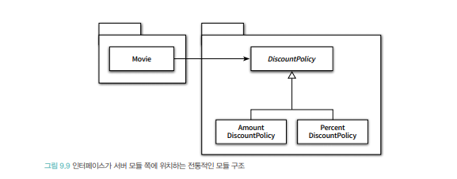
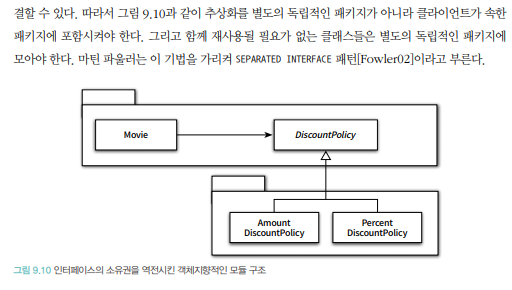
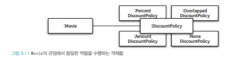

# 유연한 설계

## 1. 개방 폐쇄 원칙
- <b Style="color:orange">Open-Closed Principle, OCP</b>
  - 확장에 대해 열려 있다. : 어플리케이션의 요구사항이 변경될 때 이 변경에 맞게 새로운 "동작"을 추가해서 어플리케이션의 기능을 확장할 수 있다.
  - 수정에 대해 닫혀 있다. : 기존의 코드를 수정하지 않고도 어플리케이션의 동작을 추가하거나 변경할 수 있다.<br><Br>
    
### 컴파일 타임 의존성을 고정시키고 런타임 의존성을 변경하라.
- 개방- 폐쇄 원칙은 런타임 의존성과 컴파일타임 의존성에 관한 이야기다.
 런타임 의존성은 실행시에 협력에 참여하는 객체들 사이의 관계다. <bR>
- 실행시에 다형성을 통해 인스턴스 해주어서 의존성을 맞추어주는 것의 차이.

### 추상화가 핵심이다.
- 개방-폐쇄의 원칙의 핵심은 추상화에 의존하는 것이다.<br>
여기서 추상화와 의존이라는 두 개념 모두가 중요하다.
  
- 추상화란 핵심적인 부분만 남기고 불필요한 부분은 생략함으로써 복잡성을 극복하는 기법이다.<bR?>
추상화 과정을 거치면 문맥이 바뀌더라도 변하지 않는 부분만 남게 되고 문맥에 따라 변하는 부분은 생략된다.<br>
  추상화를 사용하면 생략된 부분을 문맥에 적합한 내용으로 채워넣음으로써 각 문맥에 적합하게 기능을 구체화하고 확장할 수 있다.<br><br>
  개방-폐쇄 원칙의 관점에서 생략되지 않고 남겨지는 부분은 다양한 상황에서의 공통점을 반영한 추상화의 결과물이다.
  공통적인 부분은 문맥이 바뀌더라도 변하지 않아야 한다.<br>
  다시 말해서 수정할 필요가 없어야한다.
  
- 여기서 변하지 않는 부분을 고정하고 변하는 부분을 생략하는 추상화 메커니즘이 개방-폐쇄 원칙의 기반이 된다는 사실.
- 어떤 개념을 추상화했다고 해서 수정에 대해 닫혀 있는 설계를 만들 수 있는 것은 아니다.<bR>
개방-폐쇄 원칙에서 폐쇄를 가능하게 하는 것은 의존성의 방향이다.<br>
수정에 대한 영향을 최소화하기 위해서는 모든 요소가 추상화에 의존해야 한다.
  
## 2. 생성 사용 분리
- 객체 생성에 대한 대한 지식은 과도한 결합도를 초래하는 경향이 있다.
객체의 타입과 생성자에 전달해야 하는 인자에 대한 과도한 지식은 코드를 특정한 컨텍스트에 강하게 결합시킨다.<br>
  컨텍스트를 바꾸기 위한 유일한 방법은 코드 안에 명시돼 있는 컨텍스트에 대한 정보를 직접 수정하는 것 뿐이다.
  
- 객체 생성을 피할 수 없다.<bR>
유연하고 재사용 가능한 설계를 원한다면 객체와 관련된 두 가지 책임을 서로 다른 객체로 분리해야 한다.<br>
  하나는 객체를 생성하는 것이고, 다른 하나는 객체를 사용하는 것이다.<br>
  한 마디로 말해서 객체에 대한 생성과 사용을 분리 (separating use from creation)해야 한다.
  
- 사용으로부터 생성을 분리하는데 사용되는 가장 보편적인 방법은 객체를 생성할 책임을 클라이언트로 옮긴다.<br>
객체를 생성과 동시에 사용처로 사용하는 것이 부적절하다는 것. 
  객체를 구현체 생성시에 사용 한다는 것이 부적절 하다는 것이다. `DiscountPolicy`로 지정된 자리에 `AmountDiscountPolicy`나 `PercentDiscountPolicy`로 생성시에 구분해서 사용이 가능하다는 것.
  
### FACTORY 추가하기
- 생성 채김을 `CLient`로 옮긴 배경에는 `Movie`는 특정 컨텍스트에 묶여서는 안 되지만 `Client`는 묶여도 상관이 없다는 전제가 깔려있다.<br>
하지만 `Client`도 특정한 컨텍스트에 묶이지 않기를 바란다고 가정한다면 사용한다.<br>
  
- 하지만 `Client` 역시 생성과 사용의 책임을 함께 지니고 있는 것이다.<br>
인스턴스를 사용할 문맥을 결정할 클라이언트로 옮기는 것이다.<br>
하지만 객체 생성과 관련된 지식이 `Client`와 협력하는 클라이언트에게까지 새어나가기를 원하지 않는다고 가정해본다면.<Br>
  - 객체 생성과 관련된 책임만 전담하는 별도의 객체를 추가하고 `Client`는 이 객체를 사용하도록 만들 수 있다.
  - 생성과 사용 분리하기 위해 객체 생성에 특화된 객체를 `FACTORY`라고 부른다.

### 순수한 가공물에게 책임 할당하기
- 책임 할당 원칙을 패턴의 형태로 기술한 GRASP패턴을 볼 때, 책임 할당의 가장 기본이 되는 원칙은 책임을 수행하는 데 필요한 정보를 가장 많이 알고 있는 `INFORMATION EXPERT`에게 책임을 할당하는 것이다.
도멘인 모델은 `INFORMATION EXPERT`를 찾기 위해 참조할 수 있는 일차적인 재료다.<br>
  어떤 책임을 할당하고 싶다면 제일 먼저 도메인 모델 안의 개념 중에서 적절한 후보가 존재하는지 찾아봐야 한다.<br>br<.
  
- `FACTORY` 는 도메인 모델에 속하지 않는다.<br>
`FACTORY`를 추가한 이유는 순수하게 기술적인 결정이다.<br>
  전체적으로 결합도를 낮추고 재사용성을 높이기 위해 도메인 개념에게 할당돼 있던 객체 생성 책임을 도메인 개념과는 아무런 상관이 없는 가공의 객체로 이동시킨 것이다.<br>
  - 크레이그 라만 : 1. 표현적 분해 (representational decomposition).
                  2. 행위적 분해 (behavioral decomposition).
    
- 표현적 분해는 도메인에 존재하는 사물 또는 개념을 표현하는 객체들을 이용해 시스템을 분해하는 것이다.<br>
표현적 분해는 도메인 모델에 담겨 있는 개념과 관계를 따르며 도메인과 소프트웨어 사이의 표현적 차이를 최소화하는 것을 목적으로 한다.<br>
  표현적 분해는 객체지향 설계를 위한 가장 기본적인 접근법이다.<br><br>
  그러나 종종 도메인 개념을 표현하는 객체에게 책임을 할당하는 것만으로는 부족한 경우가 발생한다.<br>
  도메인 모델은 설계를 위한 중요한 출발점이지만 단지 출발점이라는 사실을 명심해야 한다.<br>
  
- 모든 책임을 도메인 객체에게 할당하면 낮은 응집도, 높은 결합도, 재사용성 저하와 같은 심각한 문제점에 봉착하게 될 가능성이 높아진다.<br>
이 경우 도메인 개념을 표현한 객체가 아닌 설계자 편의를 위해 임의로 만들어낸 가공의 객체에게 책임을 할당해서 문제를 해결해야 한다.<br>
  크레이그 라만은 이처럼 책임을 할당하기 위해 창조되는 도메인과 무관한 인공적인 객체를 <b style="color:orange">PURE FABRICATION(순수한 가공물)</b>이라고 부른다.
  <br><br>
  따라서 <b style="color:orange">PURE FABRICATION(순수한 가공물)</b>은 표현적 분해보다는 행위적 분해에 의해 생성되는 것이 일반적이다.<br><br>
  
- 어떤 행동을 추가하려고 하는데 이 행동을 책임질 마땅한 도메인 개념이 존재하지 않는다면 <b style="color:orange">PURE FABRICATION(순수한 가공물)</b>을 추가하고 이 객체에게 책임을 할당하라.<br>
그 결과로 추가된 <b style="color:orange">PURE FABRICATION(순수한 가공물)</b>은 보통 특정한 행동을 표현하는 것이 일반적이다.
  따라서 <b style="color:orange">PURE FABRICATION(순수한 가공물)</b>은 표현적 분해보다는 행위적 분해에 의핸 생성되는 것이 일반적이다.

<b style="color:orange">PURE FABRICATION(순수한 가공물)</b>
- 객체지향 설계는 문제 도메인 상의 개념을 소프트웨어 객체로 구현하고 할당한다.<Br>
만약 도메인 객체에 책임을 할당할 경우 HIGH COHESION, LOW COUPLING 재사용성 등의 목적을 위반한다면 어떻게 해야 하는가?<br><br>
  문제 도메인 개념을 표현 않는 인위적으로 또는 편의상 만든 클래스에 매우 응집된 책임을 할당하라.<br>
  이들 클래스는 문제 도메인 상에는 존재하지 않지만 순수하게 전체 설계의 품질을 높이기 위해 설계의 품질을 높이기 위해 설계자와 임의에 따라 추가한 상상 속의 가공물이다.<br>

<b style="color:orange">PURE FABRICATION(순수한 가공물)</b>은 `INFORMATION EXPERT` 패턴에 따라 책임에 따라 책임을 할당한 결과 바람직하지 않은 경우 대안으로 사용된다.<br>
어떤 객체가 수행하는 데 필요한 많은 정보를 가졌지만 해당 책임을 할당할 경우 응집도가 낮아지고 결합도가 높아진다면 가공의 객체를 추가해서 책임을 옮기는 것을 고민하라.<br>
순수한 가공물<b style="color:orange">PURE FABRICATION</b>이라는 표현은 적절한 대안이 없을 때 사람들이 창조적인 무언가를 만들어낸다는 것을 의미하는 관용적인 표현이다.<br><br>
도메인 모델에서 출발해서 설계에 유연성을 추가하기 위해 책임을 이리저리 옮기다 보면 많은 PURE FABRICATION 이다.
<br><br>

## 03 의존성 주입
- 사용하는 객체가 아닌 외부의 독립적인 객체가 인스턴스를 전달해야 한다는 것을 의미한다.<br>
이처럼 사용하는 객체가 아닌 외부의 독립적인 객체가 인스턴스를 생성한 후 이를 전달해서 의존성을 해결하는 방법을 의존성을 주입 (Dependency Injection)이라고 부른다.<br>
  1. 생성자 주입 : 객체를 생성하는 시점에 생성자를 통한 의존성 해결이다.
  2. Setter 주입 : 객체 생성 후 Setter 메서드를 통한 의존성 해결이다.
  3. 메서드 주입 : 메서드 실행시 인자를 이용한 의존성 해결이다.
  `avatar.calculateDiscountAmount(Screening, new AmountDiscountPolicy());`
     
 프로퍼티 주입과 인터페이스 주입
- JAVA Beans 명세는 속성을 설정하는 메서드를 접두사 `set`이라는 접두사로 시작해야 한다고 규정하고 있으며 이전 메서드를 `Setter`이라고 한다.<br>
  (C#에서는 자바의 세터를 대처할 수 있는 프로퍼티라는 기능을 제공한다. c#에서는 Setter => 프로퍼티 주입.)<br><br>
  
* 인터페이스 주입이라는 의존성 주입
 - 주입할 의존성을 명시하기 위해 인터페이스를 사용한다.<br>
```java
public interface DiscountPolicyInjectionTable{
    public void injection (DiscountPolicy discountPolicy);
}
```
```java
{
@Override
public void inject(Discount dicount){
    this.discountPolicy = discountPolicy;
        }
      }
```             
- 인터페이스 주입은 전통저그로 Setter 주입이나 프로퍼티 주입과 동일하다.<Br>
단지 어떤 대상을 주입할건지 인터페이스를 통해 명시적으로 선언하는 차이이다.
  
### 숨겨진 의존성 나쁘다.
- SERVICE LOCATOR 패턴<BR>
  - 의존성을 해결할 객체들을 보관하는 일종의 저장소
  - 외부에서 객체에게 의존성을 전달하는 의존성 주입과 달리 SERVICE LOCATOR의 경우 객체가 직접 SERVICE LOCATOR객체가 직접 SERVICE LOCATOR에게 의존성을 해결할 것을 요청한다.
  - SERVICE LOCATOR 패턴은 서비스를 사용하는 코드로부터 서비스가 누구인지, 서비스를 구현한 구체 클래스의 타입이 무엇인지, 어디에 있는지,(클래스 인스턴스를 어떻게 얻을지)를 몰라도 되게 해준다.
```JAVA
public class movie{
  private DiscountPolicy discountPolicy;
    public Movie(String title, Duration runningTime, Money fee){
     this.title = title;
     this.runningTime = runningTime;
     this.fee = fee;
     this.discountPolicy = serviceLocator.discountPolicy;
    }
} 
```
  - SERVICE LOCATOR는 DiscountPolicy의 인스턴스를 등록하고 반환할 수 있는 메서드를 구현한 저장소다.<br>?
    SERVICE LOCATOR는 DiscountPolicy의 인스턴스를 등로갛기 위한 Provide메서드와 인스턴스를 반환하는 discountPolicy의 인스턴스를 등록하기 위한 provide 메서드와 인스턴스를 반환하는 discountPolicy 메서드로 구현한다.
```java
public class ServiceLocator {
    private  static ServiceLocator soleInstance = new ServiceLocator();
    private DiscountPolicy discountPolicy;
    
    private static DiscountPolicy discountPolicy(){
        return soleInstance.discountPolicy;
    }
    private ServiceLocator(){}
}
```
  - Movie의 인스턴스가 AmountDiscountPolicy의 인스턴스에 의존하ㅓ기를 원한다면 다음과 같이 ServiceLocator에 인스턴스를 등록한 후 Movie를 생성하면 된다.<br>
```java
ServiceLoacator.provide(new AmounbDiscountPolicy);
Movie avater = new Movie ("아바타", duration.ofMinute(120),Money.wons(10000));
```
```java
ServiceLocator.provide(new PercentDiscountPolicy(...));)
Movie avater = new Movie ("아바타", Duration.ofMinutes(120), Money.wons(10000));
```
- SERVICE LOCATOR 패턴의 단점
  - 의존성을 감춘다.
  - 인스턴스 생성에 필요한 모든 인자를 생성자에 전달 하기 때문에 포함이 되어 명시적인 부분만 보았다간 DiscountPolicy의 값이 null이라는 사실을 모르게 된다.<br>
  이러한 것을 검파일 시점에는 모르지만, 런타임에 가서야 발견된다는 것이 문제이다.
  - 단위 테스트 작성도 어렵다.
    - 각 모든 단위테스트는 서로 고립되어야 한다는 단위 테스트의 기본 원칙을 위반한다. 단순히 인스턴스 변수의 가시성을 private로 선언하고 변경되는 내용을 숨겼다고 해서 캡슐화가 지켜지는 것은 아니다.<bR><br>
  
- 캡슐화는 코드를 읽고 이해하는 행위와 관련이 있다.
클래스의 퍼블릭 인터페이스만으로 사용방법을 이해할 수 있는 코드가 캡슐화의 관점에서 훌륭한 코드다.
  클래스의 사용을 위해 내부를 샅샅이 뒤져야 한다면 그 클래스의 캡슐화는 무너진 것이다.
  
- 숨겨진 의존성은 캡슐화를 위반
- 의존성을 구현 내부로 감출수록 강요하는 SERVICE LOCATOR는 캡슐화를 위반할 수 밖에 없다.
- 의존성의 대상을 설정하는 시점과 의존성이 해결되는 시점을 멀리 떨어뜨려 놓는다.
- 의존성을 객체의 퍼블릭 인터페이스에 노출하라.
- SERVICE LOCATOR 사용경우
  - 의존성 주입을 해주는 프레임워크를 사용할 수 없다.
  - 깊은 호출 계층에 걸쳐 동일한 객체를 계속해서 전달해야하는 경우.<bR>
  
   1 .접근해야할 객체가 있따면 전역메커니즘 대신 필요한 객체를 인수로 넘겨줄 수는 없는지 생각해 볼 것.
   2. 로그와 메모리 관리 같은 정보가 모듈의 공개 API에 포함되어 있으면 안된다.<bR>
  레더링 함수 매개변수 에는 렌더링에 관련된 것을 있어야 하며 로그 같은 것이 섞여 있어서는 곤란하다.
      
## 의존성 역전 법칙
### 추상화의 의존성 역전
- 의존성 역전 원칙(Dependency Inversion Principle, DIP)
  1. 상위 수준의 모듈은 하위 수준의 모듈에 의존해서는 안된다.
  둘 모두 다 추상화에 의존해야 한다.
  2. 추상화는 구체적인 사항에 의존하면 안된다. 추체적인 사항은 추상화에 의존해야 한다.
  
### 의존성 역전 원칙과 패키지
 - 역전은 의존성의 방향 뿐 아니라 인터페이스의 소유권에도 적용.
 - 자바는 패키지를 이용해 모듈 구현.

   
   
- 의존성 역전 원칙에 따라 상위 수준의 협력 흐름을 재사용하기 위해서는 추상화가 제공하는 인터페이스이 소유권 역시 역전시켜야한다.<bR>
- 전통적인 설계 패러다임은 인터페이스 소유권을 클라이언트 모듈이 아닌 서버 모듈에 위치시키는 반면 잘 설계된 객체지향 어플리케이션에서는 인터페이스의 소유권을 서버가 아닌 클라이언트에 위치시킨다.<bR>
- 유연하고 재사용 가능하며 컨텍스트에 독립적인 설계는 전통적인 패러다임이 고수하는 의존성의 방향을 역전시킨다.<bR>
전통적인 패러다임 패러다임에서는 상위 수준 모듈이 하위 수준 모듈에 의존했다면 객체지향 패러다임에서는 상위 수준 모듈과 하위 수준 모듈이 모두 추상화에 의존한다.<br>
  
## 유연성에 대한 조언
### 유연한 설계는 유연성이 필요할 때만 옳다.
- 설계가 유연할수록 클래스 구조와 객체 구조 사이의 거리는 점점 멀어진다.<br>
따라서 유연함은 단순성과 명확성의 희생 위에서 자라난다.<bR>
  유연한 설계를 단순하고 명확하게 만드는 유일한 방법은 사람들 간의 긴밀한 커뮤니케이션 뿐이다.<br>
  복잡성이 필요한 이유와 합리적인 근거를 제시하지 않는다면 어느 누구도 설계를 만족스러운 해법으로 받아들이지 않는다.
  
- 불필요한 유연성을 불필요한 복잡성을 낳는다. 단순하고 명확한 해법이 그런대로 만족스럽다면 유연성을 제거하라.

### 협력과 책임이 중요하다.
