# 11장 합성과 유연한 설계
- 상속 : 부모 클래스와 자식 클래스를 연결해서 부모 클래스의 코드 재사용.
  - is-a 관계
  - 부모 클래스의 내부 구현에 대해 상세하게 알아야 하기 때문에 자식 클래스와 부모 클래스 간의 결합도가 높아질 수 밖에 없다. 
  - 클래스 사이가 정적인 관계.
  - 재사용 대상 : 부모 클래스 안에 구현된 코드 자체를 재사용.
  - 서브 클래싱에 의한 재사용 = > 화이트 박스 재사용    


- 합성 : 전체를 표현하는 객체가 부분을 표현하는 객체를 포함해서 부분 객체의 코드를 재사용.
  - has-a 관계
  - 구현에 의존하지 않고 퍼블릭 인터페이스에 의존한다.
  - 클래스 사이가 동적인 관계.
  - 객체의 퍼블릭 인터페이스를 재사용.
 -  인터페이스를 명확하게 정의 => 블랙박스 재사용.

## 상속을 합성으로 변경하기
- 불필요한 인터페이스 상속 문제
  - 자식 클래스에게는 부적합한 부모 클래스의 오퍼레이션이 상속되기 때문에 자식 클래스 인스턴스의 상태가 불아전해지는 문제.
    (예시 : JDK : java.util.Properties / java.util.Stack)
    
- 메서드 오버라이딩의 오작용 문제
  - 자식 클래스가 부모클래스의 메서드를 오버라이딩할 때 자식 클래스가 부모 클래스의 메서드 호출 방법에 영향을 받는 문제.
    java.util.HashSet을 상속받은 InstrumentedHashSet이 예시.
    
- 부모 클래스와 자식 클래스의 동시 수정 문제
  - 부모 클래스와 자식 클래스 사이의 개념적인 결합으로 인해 부모 클래스를 변경할 때 자식 클래스도 함꼐 변경해야 하는 문제.<br>
    Playlist 를 상속받은 PersonalPlaylist가 예시.
    
### 불필요한 인터페이스 상속 문제 : java.util.Properties 와 java.util.Stack
- Peroperties 클래스에서 상속 관계를 제거. Hashtable을 Properties 의 인스턴스 변수로 포함시키면 합성 관계로 변경.
```java
public class Properties {
    private Hashtable<String,String> properties = new Hashtable<>();
    
    public String setProperty(String key, String value){
        return properties.put(key, value);
    }
    
    public String getProperty(String key){
        return properties.gets(key);
    }
}
```

- Vector를 상속 받는 Stack 역시 Vector의 인스턴스 변수를 Stack 클래스의 인스턴스 변수로 선언함으로써 합성 관계로 변경할 수 있다.
```java
public class Stack<E>{
    private Vector<E> elements = new Vector<>();
    
    public E push(E item){
        elements.addElements(item);
        return item;
    }
    
    public E pop (){
        if(elements.isEmpty()){
            throw new EmptyStackException();
        }
        return elements.remove(elements.size() -1);
    }
}
```

### 메서드 오버라이딩의 오작용 문제 :InstrumentedHashSet
```java
public class InstrumentedHashSet<E> {
    private int addCount = 0;
    private Set<E> set;
    
    public InstrumentedHashSet(Set<E> set){
        this.set = set;
    }
    
    public boolean add(E e){
        addCount++;
        return set.add(e);
    }
    
    public boolean addAll(Collection<? extends E> c){
        addCount += c.size();
        return set.addAll(c);
    }
    
    public int getAddCount(){
        return addCount;
    }
}
```
---> 인터페이스 사용 

```java
public class InstrumentedHashSet<E> implements Set<E>{
    private int addCount = 0;
    private Set<E> set;
    
    public InstrumentedHashSet(Set<E> set){
        this.set = set;
    }
    
    @Override
    public boolean add(E e){
        addCount++;
        return set.add(e);
    }
  @Override
    public boolean addAll(Collection<? extends E> c){
        addCount += c.size();
        return set.addAll(c);
    }
    
    public int getAddCount(){
        return addCount;
    }
  
}
```
- InstrumentedHashSet의 코드를 보면 Set의 오퍼리에션을 오버라이딩한 인스턴스 메서드에서 내부의 HashSet 인스턴스에게 동일한 메서드 호출을 그대로 전달하는 것을 알 수 있다.<br>
이를 <b style="color:orange">포워딩(forwarding)</b> 이라고 하고. <br>
동일한 메서드를 호출하기 위해 추가된 메서드를 <b style="color:orange">포워딩 메서드(forwarding method)</b>라고 부른다.
  
- 포워딩 : 기존 크랠스의 인터페이스를 그대로 외부에 제공하면서 구현에 대한 결합 없이 일부 작동 방식을 변경하고 싶은 경우에 사용할 수 있는 기법.

### 부모 클래스와 자식 클래스의 동시 수정 문제 :PersonPlaylist
```java
public class PersonalPlaylist{
    private Playlist playlist = new PersonalPlaylist();
    
    public void append(Song song){
        playlist.append(song);
    }
    
    public void remove(Song song){
        playlist.getTracks().remove(song);
        playlist.getSingers().remove(song.getSinger());
    }
}
```
- 대부분의 경우 구현에 대한 결합 보다 인터페이스에 대한 결합이 더좋다.

- 몽키패치(Moneky Patch) 
  - 현재 실행 중인 환경에만 영향을 미치도록 지역적으로 코드를 수정하거나 확장하는 것을 가리킨다.
  예를 들어 Playlist의 코드를 수정할 권한이 없거나 소스코드가 존재하지 않는다고 하더라도 몽키 패치가 지원되는 환경이라면 Playlist에 직접 remove메서드를 추가하는 것이 가능하다.
  자바는 언어 차원에서 몽키패치를 지원하지 않기 때문에 바이트코드를 직접 변환하거나 AOP(Apsect-Oriented Programming)을 이용해 몽키 패치를 구현하고 있다.
    
- 상속과 비교해서 합성이 안정성과 유연성이라는 장점을 제공한다.

## 상속으로 인한 조합의 폭발적인 증가
- 하나의 기능을 추가하기 위해 불필요하게 많은 수의 클래스를 추가하거나 수정해야 한다.
- 단일 상속만 지원하는 언어에서는 상속으로 인해 오히려 중복 코드의 양이 늘어날 수 있다.

### 기본 정책과 부가 정책 조합하기
 - 

- 부가 정책이 갖는 특성
  - 기본 정책의 계산 결과에 적용된다.
    기본 정책인 RegularPhone 이나 NightlyDiscountPhone의 계산이 끝난 결과에 세금 부과.
  
- 선택적으로 적용 가능
  - 기본 정책의 계산 결과에 세금 정책을 적용할 수도 있고 적용하지 않을 수도 있다.
  
- 조합 가능 
  - 기본정책에 세금 정책만 적용 가능, 기본 요금 할인 정책만 적용하는 것도 가능.<br>
  또한 세금 정책과 기본 요금 할인 정책을 함께 적용하는 것도 가능해야 한다.
    
- 부가 정책은 임의의 순서로 적용 가능
  - 기본 정책에 세금 정책과 기본 요금 할인 정책을 함께 적용할 경우 세금 정책을 적용한 후에 기본 요금 할인 정책을 적용할 수 있고, 기본 요금 할인 정책을 적용한 후에 세금 정책을 적용할 수도 있다.
  
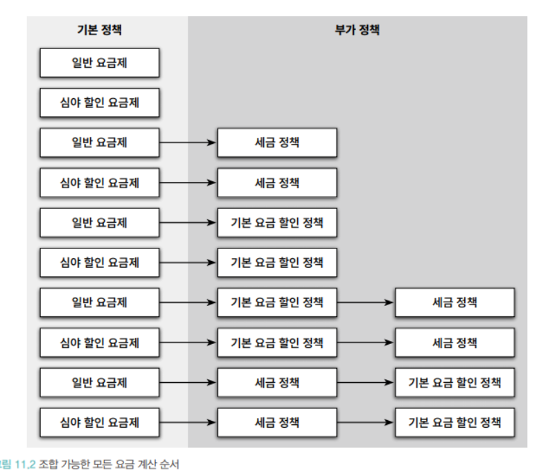

### 상속을 이용한 기본 정책 구현

```java
public abstract class Phone {
  private List<Call> calls = new ArrayList<>();

  public Monkey calculateFee() {
    Monkey result = Money.ZERO;
    for (Call call : calls) {
      result = result.plus(calculateFee(call));
    }
    return result;
  }

  abstract protected Money caculateCallFee(Call call);

}

public class RegularPhone extends Phone {
  private Money amount;
  private Duration seconds;

  public RegularPhone(Money amount, Duration seconds) {
    this.amount = amount;
    this.seconds = seconds;
  }

  @java.lang.Override
  protected Money caculateCallFee(Call call) {
    return amount.times(call.getDuration().getSeconds() / seconds.getSeconds());
  }
}

public class NightlyDiscountPhone extends Phone {
  private static final int LATE_NIGHT_HOUR = 22;

  private Money nightlyAmount;
  private Money regularAmount;
  private Duration seconds;

  public NightlyDiscountPhone(Mony nightlyAmount, Money regularAmount, Duration seconds) {
    this.nightlyAmount = nightlyAmount;
    this.regularAmount = regularAmount;
    this.seconds = seconds;
  }

  @Override
  protected Money caculateCallFee(Call call) {
    if (call.getFrom().getHour() >= LATE_NIGHT_HOUR) {
      return nightlyAmount.times(call.getDuration().getSeconds() / seconds.getSeconds());
    }
    return regularAmount.times(call.getDuration().getSeconds()/seconds.getSeconds());
  }
}
```
  
### 기본 정채겡 세금 정책 조합하기
```java
public class TaxableRegularPhone extends RegularPhone{
    private double taxRate;
    
    public TaxableRegularPhone(Money amount, Duration seconds, double taxRate){
        super(amount, seconds);
        this.taxRate = taxRate;
    }
    @Override
  public Money calculateFee(){
        Money fee = super.calculateFee();
        return fee.plus(fee.times(taxRate));
    }
}
```
- 부모 클래스의 메서드를 재사용 하기 위해 `super`호출을 사용하면 원하느 결과를 쉽게 얻을 순 있지만 자식 클래스와 부모 클래스의 결합도가 높아지고 만다.<bR>
결합도를 낮추는 방법은 자식 클래스가 부모 클래스의 메서드를 호출하지 않도록 부모 클래스에 추상 메서드를 제공하는 것이다.<bR>
  부모 클래스가 자신이 정의한 후상 메서드를 호출하고 자식 클래스가 이 메서드를 오버라이딩해서 부모 클래스가 원하는 로직을 제공하도록 수정하면 부모 클래스와 자식 클래스 사이의 결합도를 느슨하게 만들 수 있다.
  이 방법은 자식 클래스가 부모 클래스의 구체적인 구현이 아니라 필요한 동작의 명세를 기술하는 추상화에 의존하도록 만든다.

먼저 Phone 클래스에 새로운 추상 메서드인 `afterCalculated`를 추가하자.<br>
이 메서드는 자식 클래스에게 전체 요금을 계산한 후에 수행할 로직을 추가할 수 있는 기회를 제공한다.
```java
public abstract class Phone {
    private List<Call> calls = new ArrayList<>();
    
    public Money calculatedFee(){
        Money result = Money.ZERO;
        
        for(Call call : calls){
            result=result.plus(calculatedCallFee(call));
        }
        return afterCalculated(result);
    }
    
    protected abstract Money calculatedCallFee(Call call);
    protected abstract Money afterCalculated(Money fee);
}
```
자식 클래스는 `afterCalculated`메서드를 오버라이딩해서 계산된 요금에 적용할 작업을 추가한다.
일반 요금제를 구현하는 `RegularPhone`은 요금을 수정할 필요가 없기 때문에 afterCalculated메서드에서 파라미터로 전달된 요금을 그대로 반환하도록 구현.
```java
public class RegularPhone extends Phone {
  private Money amount;
  private Duration seconds;

  public RegularPhone(Money amount, Duration seconds) {
    this.amount = amount;
    this.seconds = seconds;
  }

  @Override
  protected Money caculateCallFee(Call call) {
    return amount.times(call.getDuration().getSeconds() / seconds.getSeconds());
  }
  
  @Overrid
  protected Money afterCalculated(Money fee){
      return fee;
  }
}
```
심야 할ㅇ니 요금제를 구현하는 NitghlyDiscountPhone 클래스 역시 수정해야한다.
```java
public class NightlyDiscountPhone extends Phone {
  private static final int LATE_NIGHT_HOUR = 22;

  private Money nightlyAmount;
  private Money regularAmount;
  private Duration seconds;

  public NightlyDiscountPhone(Mony nightlyAmount, Money regularAmount, Duration seconds) {
    this.nightlyAmount = nightlyAmount;
    this.regularAmount = regularAmount;
    this.seconds = seconds;
  }

  @Override
  protected Money caculateCallFee(Call call) {
    if (call.getFrom().getHour() >= LATE_NIGHT_HOUR) {
      return nightlyAmount.times(call.getDuration().getSeconds() / seconds.getSeconds());
    } else {
      return regularAmount.times(call.getDuration().getSeconds()/seconds.getSeconds());
    }
  }
  @Override
  protected Money afterCalculated(Money fee){
      return fee;
  }
}
```
- 위에서 알 수 있듯이 부모클래스에 추상 메서드를 추가하면 모든 자식 클래스들이 추상 메서드를 오버라이딩 해야하는 문제자 발생한다.<br>
자식 클래스의 수가 적다면 문제는 안되지만 번거로운 일이다.
  <br> <br>
  모든 추상 메서드의 구현이 동일하다는 사실에도 주목해야한다.<bR>
  유연성은 유지하면서도 중복 코드를 제거할 수 있는 방법은 Phone에서 afterCalculated 메서드에 대한 기본 구현을 함께 제공하는 것이다.<br>
  이제 RegularPhone과 NightlyDiscountPhone 클래스에는 afterCalculated 메서드를 오버라이딩할 필요가 없다.
  
```java
public abstract class Phone{
    ...
  proteted Money afterCalculated(Money fee){
        return fee;
  }
  
  protected abstract Money calculatedCallFee(Call call);
    
}
```
-   추상 메서드와 훅 메서드
  - 개방-폐쇄 원칙을 만족하는 설계를 만들 수 있는 한가지 방법은 부모 클래스에 새로운 추상 메서드를 추가하고 부모 클래스의 다른 메서드 안에서 호출하는 것이다.<Br>
자식 클래스는 추상 메서드를 오버라이딩하고 자신만의 로직을 ㅜㄱ현해서 부모 클래스에서 정의한 플로에 개입할 수 있게 된다.<Br><br><bR>   
    추상 머세드의 단점은 상속 계층에 속하는 몯느 자식 클래스가 추상 메서드를 오버라이딩해야 한다는 것이다.<br>
    대부분의 자식 클래스가 추상 메서드를 동일한 방식으로 구현한다면 상속 계층 전반에 걸쳐 중복 코드가 존재하게 될 것이다.<br>
    해결 방법은 메서드에 기본 구현을 제공하는 것이다 . 이처럼 추상 메서드의 동일하게 자식 클래스에서 오버라이딩할 의도로 메서드를 추가했지만 편의를 위해 기본 구현을 제공하는 메서드를 훅 메서드 라고 부른다.
    예제에서 기본구현을 가지도록 수정된 `afterCalculated`메서드가 훅 메서드이다
    

```java
public class TaxableRegularPhone extends RegularPhone{
    private double taxRate;
    
    public TaxableRegularPhone(Money amount, Duration seconds, double taxRate){
        super(amount, seconds);
        this.taxRate = taxRate;
    }
    
    @Override
  protected Money afterCalculated(Money fee){
        return fee.plus(fee.times(taxRate));
    }
}
```
```java
public class TaxableNightlyDiscountPhone extends Phone {

private double taxRate;

public TaxableNightlyDiscountPhone(Money nightlyAmount, Money regularAmount, Duration seconds, double taxRate) {
    super(nightlyAmount ,regularAm                                      qqqqqqqqqqqqqqqqqqqqqqqqqqqqqqqqqqqqqqqqqqqqqqqqqqqqqqqqqqqqqqqqqqqqqqqqqqqqqqqqqqqqqqqqqqqqqqqqqqqqqqqqqqqqqqqqqqqqqqqqqqqqqqqqqqqqqqqqqqqqqqqqqqqqqqqqqqqqqqqqqqqqqqqqqqqqqqqqqqqqqqqqqqqqqqqqqqqqqqqqqqqqqqqqqqqqqqqqqqqqqqqount,seconds);
    this.taxRate = taxRate;
}

@Override
protected Money afterCaculated(Money fee) {
return fee.plus(fee.times(taxRate)); 
}
}
```

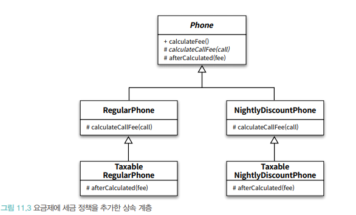

### 기본 정책에 기본 요금 할인 정책 조합하기
```java
public class RateDiscountableRegularPhone extends RegularPhone{
    private Money discounAmount;
    
    public RateDiscountableRegularPhone(Money amount, Duration seconds, Money discounAmount){
        super (amount , seconds);
        this.discounAmount = discounAmount;
    }
    @Override
  protected Money afterCalculated(Money fee){
        return fee.minus(discounAmount);
    }
    
}
```
- 심야 할인 요금제와 기본 요금 할인 정책을 조합하고 싶다면
`NightDiscountPhone`을 상속받는 RateDiscountableNightlyDiscountPhone 클래스를 추가하면 된다.

```java
public class RateDiscountableNightDiscountPhone extends NightlyDiscountPhone {
    private Money discountAmount;
    
    public RateDiscountableNightDiscountPhone(Money nightlyAmount, Money regularAmount, Duration seconds, Money discountAmount){
  super(nightlyAmount, regularAmount, seconds);
    this.discountAmount = discountAmount;
    }
    @Override
  protected Money afterCalculated(Money fee){
        return fee.minus(discountAmount);
    }
}
```
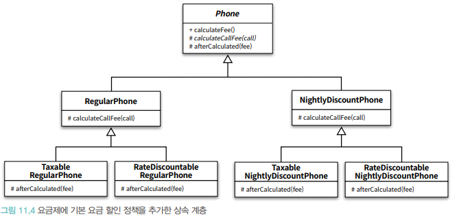
- 어떤 클래스를 선택하느냐에 따라 적용하는 요금제의 조합이 결정된다.
그리고 중복코드를 추가하게 되었다.
  
### 중복 코드의 덫에 걸리다.
- 상속을 이용한 해결 방법은 모든 가능한 조합별로 자식 클래스를 하나씩 추가하는 것이다.<br>
만약 일반 요금제의 계산 결과에 세금 정책을 조합한 후 기본 요금 할인 정책을 추가하고 시팓면 TaxableRegularPhone을 상속받는 새로운 자식 클래스인 TaxableAndRateDiscountalbeRegularPhone을 추가해야한다.
  

```java
public class TaxableAndRateDiscountalbeRegularPhone extends TaxableRegularPhone{
    private Money discountAmount;
    
    public  TaxableAndRateDiscountalbeRegularPhone (Money amount,Duration seconds, double taxRate,Money discountAmount){
        super(amount, seconds, taxRate);
        this.discountAmount = discountAmount;
    }
    @Override
  protected Money afterCalculated(Money fee){
        return super.afterCalculated(fee).minus(discountAmount);
    }
}
```

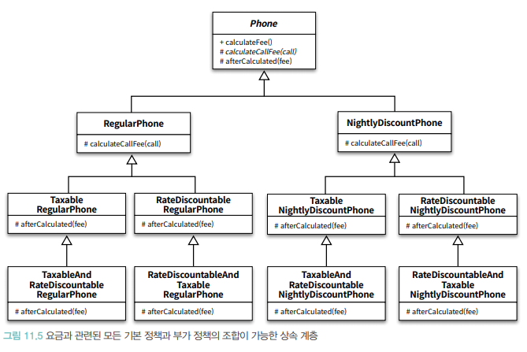

- 조합을 추가하면서 구현도니 상속 계층을 표현한 그림이다.
  - 복잡성도 높지만 문제는 새로운 정책을 추가하기가 매우 어렵다.
  - 현재의 설계에 새로운 정책을 추가하기 위해서는 불필요하게 많은 수의 클래스를 상속 계층 안에 추가해야 한다.
  

- 여기에 기본 정책을 추가하고 그 결과를 다이어그램으로 표현하면 아래와 같다.
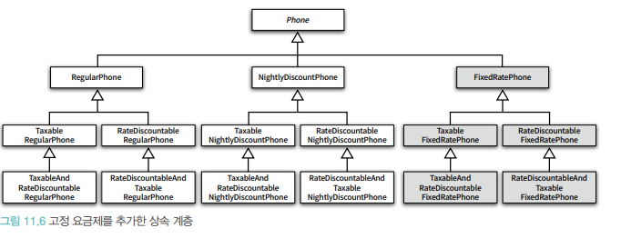
  
  
- 이처럼 상속의 남용으로 하나의 기능을 추가하기 위해 필요 이상으로 많은 수의 클래스를 추가해야하는 경우를 가리켜 <b style="color:orange">클래스 폭발(class explosion)</b>문제<br>
  또는<br>
  <b style="color:orange">조합의 폭발(combinational explosion</b>이라고 한다.
  
  - 자식 클래스가 부모 클래스의 구현에 강하게 결합되도록 강요하는 상속의 근본적인 한계 떄문에 발생한다.
  - 컴파일 타임에 결정된 자식 클래스와 부모 클래스 사이의 관계는 변경 될 수 없기 때문에 자식 클래스와 부모 클래스의 다양한 조합이 필요한 상황에서 유일한 해결 방법은 조합의 수만큼 새로운 클래스를 추가하는 것 뿐이다.
  - 수정시에도 모든 클래스를 찾아 동일한 방식으로 수정해야한다.
  - 최선의 방법은 상속을 포기하는 것이다.
  
## 합성 관계로 변경하기
- 합성은 컴파일 타임 관계를 런타임 관계로 변경함으로써 이 문제를 해결한다.<br>
합성을 사용하면 구현이 아닌 퍼블릭 인터페이스에 대해서만 의존할 수 있기 때문에 런타임에 객체의 관계를 변경할 수 있다.
  - 하지만 컴파일 타임 의존성과 런타임 의존성의 거리가 멀어질 수록 설계의 복잡도가 상승하기 때문에 코드를 이해하기 어려워진다.
  
### 기본 정책 합성하기


- 
- 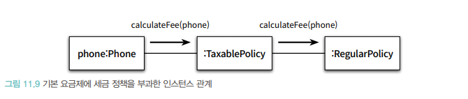
- 만약 일반 요금제에 기본 요금 할인 정책을 적용한 후에 세금 정책을 적용해야 한다고 하면 아래와 같다.
  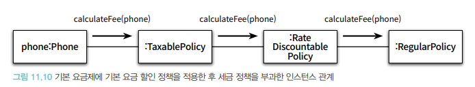
```java
public interface RatePolicy{
    Money calculateFee(Phone phone);
}
```
기본정책을 구성하는 일반 요금제와 심야 할인 요금제는 개별 요금을 계산하는 방식을 제외한 전체 처리 로직이 거의 동일하므로 중복코드를 담을 추상클래스를 만든다.

```java
public abstract class BasicRatePolicy implements RatePolicy {
  @Override
  public Money calculateFee(Phone phone) {
    Money result = Money.ZERO;

    for (Call call : phone.getCalls()) {
      result.plus(calculateFee(call));
    }
    return result;
  }

  protected abstract Money calculatedCallFee(Call call);
}

public class RegularPolicy extends BasicRatePolicy {
  private Money amount;
  private Duration seconds;

  public RegularPolicy(Money amount, Duration seconds) {
    this.amount = amount;
    this.seconds = seconds;
  }

  @Override
  protected Money calculateCallFee(Call call) {
    return amount.times(call.getDuration().getSeconds() / seconds.getSeconds());
  }
}

public class NightlyDiscountPolicy extends BasicRatePolicy {
  private static final int LATE_NIGHT_HOUR = 22;

  private Money nightlyAmount;
  private Money regularAmount;
  private Duration seconds;

  public NightlyDiscountPolicy(Moneyt nightlyAmount, Money regularAmount, Duration seconds) {
    this.nightlyAmount = nightlyAmount;
    this.regularAmount = regularAmount;
    this.seconds = seconds;
  }

  @Override
  protected Money calculateCallFee(Call call) {
    if (call.getFrom().getHour() >= LATE_NIGHT_HOUR) {
      return nightlyAmount.times(call.getDuration().getSeconds() / seconds.getSeconds());
    }
    return regularAmount.times(call.getDuration().getSeconds() / seconds.getSeconds());
  }
}

public class Phone {
  private RatePolicy ratePolicy;
  private List<Call> calls = new ArrayList<>();

  public Phone(RatePolicy ratePolicy) {
    this.ratePolicy = ratePolicy;
  }

  public List<Call> getCalls() {
    return Collections.unmodifiableList(calls);
  }
  
  public Money calculateFee(){
      return ratePolicy.calculateFee(this);
  }
}
```
- Phone 내부에 RatePolicy에 대한 참조가 포함돼 있다는 것에 주목해야 한다. 이것이 합성이다.
- Phone 다양한 요금 정책과 협력할 수 있어야 하므로 요금 정책의 타입이  RatePolicy라는 인터페이스로 정의되어 있다. <br>
Phone은 이 컴파일타임 의존성을 구체적인 런타임 의존성으로 대체하기 위해 생성자를 통해 RatePolicy의 인스턴스에 대한 의존성을 주입받는다.<br>
  Phone의 경우처럼 다양한 종류의 객체와 협력하기 위해 합성 관계를 사용하는 경우에는 합성하는 객체의 타입을 인텊에ㅣ스나 추상 클래스로 선언하고 의존성 주입을 사용해 런타임에 필요한 객체를 설정할 수 있도록 구현하는 것이 일반적이다.

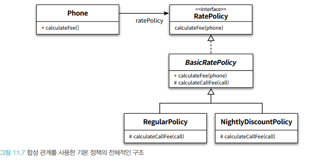

- 일반 요금제의 규칙에 따라 통화 요금을 계산한다면
Phone 과 BasicRatePolicy 의 인스턴스를 합성하면 된다.
  `Phone phone = new Phone(new RegularPolicy(Money.wons(10),Duration.ofSeconds(10)));`
  
- 심야 할인 요금제의 규칙에 따라 통화 요금을 계나하고 싶다면 다음과 같이 Phone과 NightlyDiscountPolicy 의 인스턴스를 합성하면 된다.
  `Phone phone = new Phone(new NightlyDiscountPolicy(Money.wons(10),Duration.ofSeconds(10)));`
  
### 부가정책 적용하기
- 부가 정책은 세금 정책의 계산이 끝나고 phone에게 반환되기 전에 적용 되어야 하낟.
  
- 부가 정책은 기본 정책이나 다른 부가 정책의 인스턴스를 참조할 수 있어야 한다.다시 말해서 부가 정책의 인스턴스는 어떤 종류의 정책과도 합성될 수 있어야 한다.<br>
- Phone의 입장에서는 자신이 기본 정책의 인스턴스에게 메시지를 전송하고 있는지, 부가 정책의 인스턴스에게 메시지를 전송하고 있는지를 몰라야 한다.<br>
다시 말해서 기본 정책과 부가 정책은 협력 안에서 동일한 역하을 수행해야 한다.<br>
  이것은 부가 정책이 기본 정책과 동일한 RatePolicy 인터페이스를 구현한다는 것을 의미한다.
  
- 부가 정책을 AdditionalRatePolicy 추상 클래스로 구현한다.
```java
//-- 부가정책
public abstract class AdditionalRatePolicy implements RatePolicy{
    private RatePolicy next;
    
    public AdditionalRatePolicy(RatePolicy next){
        this.next= next;
    }
    
    @Override
  public Money calculateFee(Phone phone){
        Money fee = next.calculateFee(phone);
        return afterCalculated(fee);
    }
    
    abstract protected Money afterCalculated(Money fee);
}

//--- 세금 정책
public class TaxablePolicy extends AdditionalRatePolicy{
    private double taxRatio;
    
    public TaxablePolicy(double taxRatio, RatePolicy next){
        super(next);
        this.taxRatio = taxRatio;
    }
    
    @Override
  protected Money afterCalculated(Money fee){
        return fee.plus(fee.times(taxRatio));
    }
}
//-- 기본 요금 할인 정책 추가
public class RateDiscountPolicy extends AdditionalRatePolicy{
    private Money discountAmount;
    
    public RateDiscountPolicy(Money discountAmount, RatePolicy next){
        super(next);
        this.discountAmount = discountAmount;
    }
    @Override
  protected Money afterCalculated(Money fee){
        return fee.minus(discountAmount);
    }
}
```
위 클래스들의 다이어그램이다
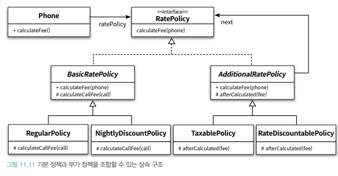

### 기본정책과 부가정책 합성하기

- 일반 요금제에 세금 정책을 조합할 경우의 Phone 인스턴스를 생성하는 방법
```java
Phone phone = new Phone(
        new TaxablePolicy(0.05, new RegularPolicy(...));
        )
```
- 일반 요금제에 기본 요금 할인 정책을 결과에 세금 정책을 조합하고 싶다면 다음과 같이 Phone을 생성하면 된다.

```java
Phone phone = new Phone(
        new TaxablePolicy(0.05,
        new RateDiscountablePolicy(Money.wons(1000),
        new RegularPolicy(...)));
```
- 세금 정책과 기본 요금 할인 전책이 적용되는 순서를 바꾸려면?
```java
Phone phone = new Phone(
        new RateDiscountablePolicy(Money.wons(1000),
        new TaxablePolicy(0.05,
        new RegularPolicy(...)));
```

- 동일한 정책을 심야 할인 요금제에도 적용하고 싶은가?
```java
Phone phone = new Phone(
        new RateDiscountablePolicy(Money.wons(1000),
        new TaxablePolicy(0.05,
        new NightlyDiscountPolicy(...)));
```

### 새로운 정책 추가하기

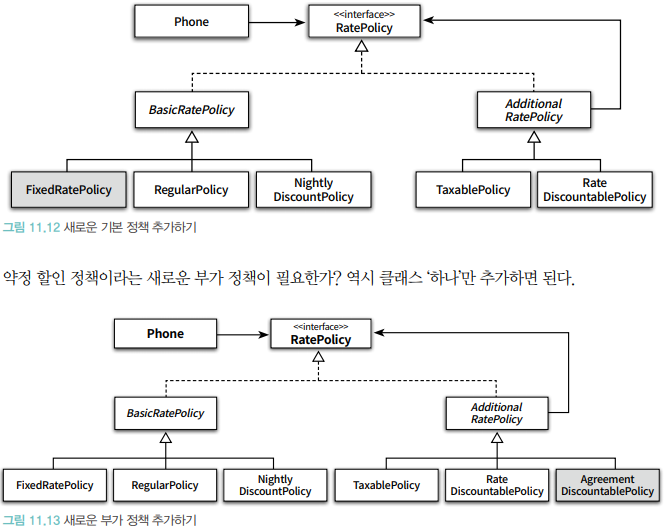

### 객체 합성이 클래스 상속보다 더 좋은 방법이다.

## 믹스인
- 합성이 상속과 같은 문제점을 초래하지 않는 이유는<br>
 클래스의 구체적인 구현이 아니라 객체의 추상적인 인터페이스에 의존하기 때문이다.<br><Br>
  상속과 클래스를 기반으로 하는 재사용 방법을 사용하면 클래스의 확장과 수정을 일관성이 있게 표현할 수 잇는 추상화의 부족으로 변경하기 어려운 코드를 얻는다.<br><Br>
  
- 따라서 구체적인 코드를 재사용하면서도 낮은 결합도를 유지할 수 있는 유일한 방법은 재사용에 적합한 추상화를 도입하는 것이다.<br>

- 믹스인은 객체를 생성할 때 코드 일부를 클래스 안에 섞어 넣어 재사용 하는 기법을 가리킨다.
  - 합성이 실행 시점에 객체를 조합하는 재사용 방법이라면 믹스인은 컴파일 시점에 필요한 코드 조각을 조합하는 재사용 방법이다.
  - 믹스인과 상속은 다르다. 
  - 상속은 클래스 사이를 고정시키지만 믹스인은 유연하게 관계를 재구성 할 수 있다.
  - 믹스인은 Flavors라는 언어에서 처음으로 도입되었고<br>
  이후 CLOS(Common Lisp Object System)에 의해 대중화 되었다.
    - 스칼라 언어에서 제공하는 트레이트(trait)를 이용해 믹스인을 구현해 본다.
    - 이유는 스칼라의 트레이트는 CLOS에서 제공했던 믹스인의 기본 철학을 가장 유사한 형태로 재현하고 있다.
  
### 기본 정책 구현
```java
abstract class BasicRatePolicy{
    def calculateFee(phone : Phone): Money =
  phone.calls.map(calculateFee(_)).reduce(_+_)
    
    protected def calculateCallFee(call: Call): Moeny;
}
```
- 표준 요금제를 구현하는 RegularPolicy는 BasicPolicy를 상속받아 개별 Call의 요금을 계산하는 calculateCallFee 메서드를 오버라이딩한다.
```java
class RegularPolicy(val amount: Money, val seconds:Duration) extends BasicRatePolicy{
    
    override protected def calculatedCallFee(call:Call): Money = amount * (call.duration.getSeconds/ seconds.getSeconds)
}
```
```java
class NightlyDiscountPolicy(
        val nightlyAmount : Money,
        val regularAmount : Money,
        val seconds: Duration) extends BasicRatePolicy{
    
    override protected def calculateCallFee(call :Call): Money = 
  if (call.from.getHour >= NightlyDiscountPolicy.LateNightHour){
      nightlyAmount * (call.duration.getSeconds / seconds.getSeconds)
  } else {
      regularAmount * (call.duration.getSeconds/ seconds.getSeconds)
  }
}
object NightlyDiscountPolicy{
    val LateNightHour : Integer = 22
        }
```

### 트레이트로 부가 정책 구현하기
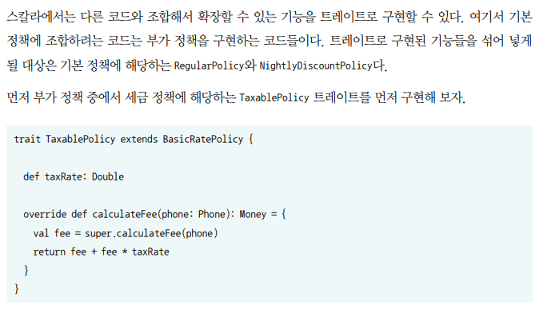

- 트레이트를 사용한 믹스인이 클래스를 사용한 상속보다 더 유연한 재사용 기법이다.<br>
상속은 재사용 가능한 문맥을 고정시키지만 트레이트는 문맥을 확장 가능하도록 열어 놓는다.
  
- 믹스인은 상속보다는 합성과 유사하다.<bR>
합성은 독립적으로 작성된 객체들을 실행 시점에 조합해서 더 큰 기능을 만들어내는데 비해 믹스인은 독립적으로 작성된 트레이트와 클래스를 코드 작성 시점에 조합해서 더 큰 기능을 만들어낼 수 있다.
  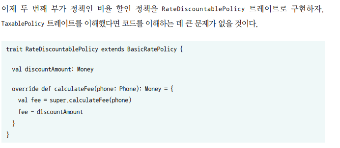
  
### 부가 정책 트레이트 믹스인하기
- 스칼라는 트레이트를 클래스나 다른 트레이트에 믹스인할 수 있도록  extends와 with  키워드를 제공한다.<br>
믹스인 하려는 대상 클래스의 부모 클래스가 존재하는 경우 부모 클래스는 extends를 이용해 상속받고 with 를 이용해 믹스인해야 한다.<br><bR>
  이를 트레이트 조합(trait composition)이라고 부른다.
  
- 스칼라는 특정 클래스에 믹스인한 클래스와 트레이트를 선형화(linearization)해서 어떤 메서드를 호출할지 결정한다.<br>
클래스의 인스턴스를 생성할 때마다 스칼라는 클래스 자신과 조상 클래스, 트레이트를 일렬로 나열해서 순서를 정한다.<br>
  그리고 실행 중인 메서드 내부에서 super를 호출하면 다음 단계에 위치한 클래스나 테이트의 메서드가 호출된다.
  
- 선형화를 할 때 항상 맨 앞에는 구현한 클래스 자기 자신이 위치한다.<Br>
 예제의 경우 맨 앞에는 TaxableRegularPolicy가 위치할 것.<br>
  그 후에 오른쪽에 선언된 트레이트를 그 다음 자리에 위치시키고 왼쪽 방향으로 가면서 순서대로 그 자리에 위치시킨다.
TaxableRegularPolicy -> TaxablePolicy ->  RegularPolicy를 위치시킨다.
  
1. TaxableRegularPolicy의 인스턴스가 calculateFee 메시지를 수신.
  - TaxableRegularPolicy 클래스에서 메시지 처리할 메서드 검색. 
  - 없으니 다음 단계 TaxablePolicy로
2. TaxablePolicy에서 메서드를 찾는다.
  - TaxablePolicy 에 calculateFee 메서드가 구현되어 있기 때문에 해당 메서드 실행.
  - 메서드 안에 super 호출이 있기 때문에 상속 계층의 다음 단계에 위치한 RegularPolicy로 
3. RegularPolicy에 calculateFee메서드 검색
  - RegularPolicy에 calculateFee메서드가 없기 때문에 다음 단계인 BasicRatePolicy로
4. BasicRatePolicy의 calcualteFee 메서드 호출
  - 표준 요금제에 따라 요금이 계산된다.
5. 제어가 taxablePolicy 트레이트로 돌아온다.
  - super 호출 이후 의 코드가 실행되고 요금에 세금이 부과된 후 반환된다.

- * 믹스인 전 까지는 상속 계층안에서 TaxablePolicy 트레이트의 위치가 결정되지 않는다.<br>
  어떤 클래스에 믹스인 할지에 따라 TaxablePolicy 트레이트의 위치는 동적으로 변경된다.
    
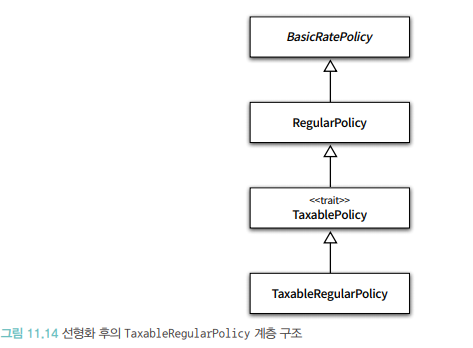
  
#### 심야 할인 요금제 구현한 NightlyDiscountPolicy 클래스에 RateDiscountablePolicy 트레이트를 믹스인 해보자.<br>
 - extends를 이용해서 NightlyDiscountPolicy 클래스를 상속 받고 with 를 이용해 RateDiscountablePolicy 트레이트를 믹스인한 새로운 클래스를 만들면 된다.<br><br>

```java
class RateDiscountableNightlyDiscountPolicy(
        nightlyAmount : Money,
        regularAmount : Money,
        seconds : Duration,
        val discountAmount : Money
) extends NightlyDiscountPolicy(nightlyAmount,regularAmount,seconds)
with RateDiscountablePolicy
```
- 먼저 표준 요금제에 세금 정책을 적용한 후에 비율 할인 정책을 적용하는 경우를 살펴보자.

1. 원하는 것은 RegularPolicy의 calculateFee메서드가 실행된 후<br> 
2. 결과에 TaxablePolicy 트레이트를 적용 하고 
3. 마지막으로 RateDiscountablePolicy 트레이트를 적용해야한다.

따라서 RateDiscountablePolicy위에 TaxablePolicy를 위치시켜야만 super 호출에 의해 세금 정책이 먼저 적용될 수 있다.

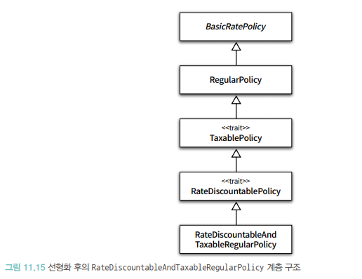
```java
class RateDiscountableAndTaxableRegularPolicy(
        amount : Money,
        seconds : Duration,
        val discountAmount : Money,
        val taxRate : Double
) extends RegularPolicy(amount, seconds)
with TaxablePolicy
with RateDiscountablePolicy
```

- 믹스인은 재사용 가능한 코드를 독립적으로 작성한 후 필요한 곳에서 쉽게 조합할 수 있게 해준다.

- 클래스 폭발 문제의 단점은 클래스가 늘어난다는 점보다는 클래스가 늘어남과 동시에 중복 코드도 함께 기하급수적으로 늘어난다는 점이다.
- 만약 클래스를 만들어야 하는 것이 불만이라면 클래스를 만들지 않고도 다음과 같이 인스턴스를 생성할 때 트레이트를 믹스인 할수도 있다.

```java
new RegularPolicy(Money(100), Duration.ofSeconds(10))
with RateDiscountablePolicy
with TaxablePolicy {
    val discountAmount = Money(100)
    val taxRate = 0.02
        }
```
- 이 방법은 RateDiscountablePolicy와 TaxablePolicy를 RegularPolicy에 믹스인한 인스턴스가 오직 한 군데에서만 필요한 경우에 사용할 수 있다.
하지만 코드 여러 곳에서 동일한 트레이트를 믹스인 해서 사용해야 한다면 명시적으로 클래스를 정의하는 것이 좋다.<br>
  
### 쌓을 수 있는 변경
- 믹스인은 상속 계층 안에서 확장한 클래스보다 더 하위에 위치하게 된다.<br>
다시 말해서 믹스인은 대상 클래스의 자식 클래스 처럼 사용될 용도로 만들어지는 것이다.
  
- 믹스인을 추상 서브 클래스(abstract subclass)라고도 부른다.
  - 객체지향 언어에서 슈퍼클래스는 서브클래스를 명시하지 않고도 정의될 수 있다.<Br>
  서브 클래스가 정의될때는 슈퍼클래스를 명시해야 한다.<Br>
    믹스인은 결론적으로 슈퍼클래스로부터 상속될 클래스를 명시하는 매커니즘을 표현한다.<br>
  - 하나의 믹스인은 매우 다양한 클래스를 도출하면서 서로 다른 서브 클래스를 이용해 인스턴스화 할 수 있다.<br>
  믹스인의 이런 특성은 다중 클래스를 위한 단일의 점진적인 확장을 정의하는 데 적절하게 만든다.
  - 이 클래스들 중 하나를 슈퍼클래스로 삼아 믹스인이 인스턴스화 될 때 추가적인 행위가 확장된 클래스를 생성한다.
  <br><br>
- 믹스인을 상요하면 특정한 클래스에 대한 변경 또는 확장을 구현한 후 필요한 시점에 차례대로 추가할 수 있다.
  - 이러한 특징을 쌓을 수 있는 변경(stackable modification) 이라고 부른다.
  
