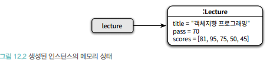
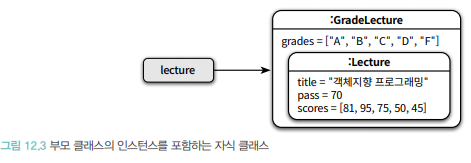
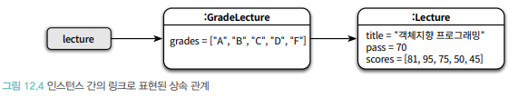
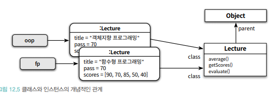
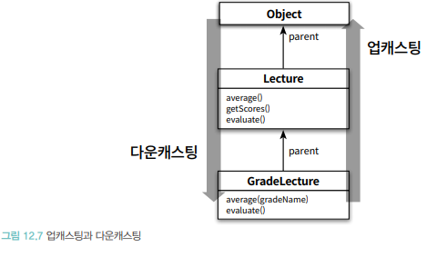
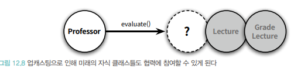

# 다형성
- 상속
  - 코드 재사용의 목적이라면 변경이 어렵고, 유연하지 못한 설계에 이를 확률이 높아진다.
  - 코드 재사용이 목적이 아니다.
  - 타입 계층을 구조화하기 위해 사용해야 한다.
    
#### 상속을 사용하기전에 체크사항
1. 코드 재사용
2. 클라이어트 관점에서 인스턴스들을 동일하게 행동하는 그룹으로 묶기 위해서 ?
   ( 1번이라면 상속 사용 X)
   
- 다형성이 런타임에 메시지를 처리하기에 적합한 메서드를 동적으로 탐색하는 과정을 통해 구현되며,<br> 
  상속이 이런 메서드를 찾기 위한 일종의 탐색 경로를 클래스 계층의 형태로 구현하기 위한 방법.
  
## 다형성
- 다형성 (Polymorphism)<br>
  하나의 추상 인터페이스에 대해 코드를 작성하고 이 추상 인터페이스에 대해 서로 다른 구현을 연결 할수 있는 능력.
  
- 객체지향에서 사용 되는 다형성
  - 유니버셜(Universal) 다형성과 임시 다형성으로 분류 가능.
    <br>
    1. 유니버셜 (Universal)
      1. 매개변수 (parameter)
      2. 포함 (inclusion)
    2. 임시 (Ad Hoc)
      1. 오버로딩 (overloading)
      2. 강제 (Corecion)
    
- 오버로딩 다형성
  - 하나의 클래스 안에 동일한 이름의 메서드가 존재하는 경우.
    
- 강제 다형성
  - 언어가 지원하는 자동적인 타입변환이나 사용자가 직접 구현한 타입변환을 이용해 동일한 연산자를 다양한 타입에 사용할 수 있는 방식이다.<br>
  ex) 자바의 이항 연산자인 '+'는 피연산자가 모두 정수일 경우에 대한 덧셈연산자로 동작하지만,<br>
    하나는 정수형 다른 하나는 문자열일 경우에는 연결 연산자로 동작한다.<br>
    이 때 정수형 피연산자는 문자열 타입으로 강제 형변환된다.<br>
    일반적으로 오버로딩 다형성과 강제 다형성을 함께 사용하면 모호해질 수 있는데 실제로 어떤 메서드가 호출될지는 판단하기가 어려워지기 때문이다.<br><br>
    
- 매개 변수 다형성
  - 제네릭 프로그래밍과 관련이 높다.
  - 클래스의 인스턴스 변수나 메서드의 매개변수 타입을 임의의 타입으로 선언한 후 사용하는 시점에 구체적인 타입으로 지정하는 방식.<br>
  ex) 자바의 ListInterface 는 컬렉션에 보관할 요소의 타입을 임의의 타입T로 지정하고 있으면 실제 인스턴스를 생성하는 시점에 T를 구체적인 타입을 지정할수 있게 하고 있다.<br>
    List 인터페이스는 다양한 타입의 요소를 다루기 위해 동일한 오퍼레이션을 사용할 수 있다.
    
- 포함 다형성
  - 메세지가 동일하더라도 숫신한 객체의 타입에 따라 실제로 수행되는 행동이 달라진다.
  - 포함 다형성은 서브타입 (subType) 다형성이라고도 한다.
  - 포함 다형성은 객체지향에서 가장 널리 알려진 형태의 다형성이다.
  - 포함 다형성을 구현하는 가장 일반적인 방법은 상속을 사용하는 것
  - 포함 다형성을 서브타입의 다형성이라고 부르는 이유 :<br>
    포함 다혀성을 위한 전제조건은 자식 클래스가 부모 클래스의 서브타입이어야 한다는 뜻.
    

- 상속의 목적 <br>
  코드 재사용이 아니라 다형성을 위한 서브타입 계층을 구축하는 것이다.
  
- 포함 다형성을 위해 상속을 사용하는 이유 :<br>
상속이 클래스들을 계층으로 쌓아 올린 후 상황에 따라 적절한 메서들르 선택할 수 없는 메커니즘 제공.<br>
  객체가 메시지를 수신하면 객체지향시스템은 메시지를 처리할 적절한 메서드를 상속계층 안에서 탐색한다.<br>
  실행 메서드는 어떤 메시지인지 어떤 클래스의 인스턴스인지에 따라 상속계층이 어떻게 구성되어 있는지에 따라 달라진다.
  
## 상속의 양면성
- 데이터 관점 상속을 이용하면<br>
부모 클래스에서 저으이된 모든 데이터도 자식클래스의 인스턴스에 자동으로 포함시킬 수 있다.
  
- 행동 관점 상속 : <bR>
데이터 부분만 아니라 부모클래스에서 정의한 일부 메서드 역시 자동으로 자식클래스에 포함시킬 수 있다.
  
- 단순히 데이터와 행동의 관점에서만 바라보면 상속이란 부모클래스에서 정의한 데이터와 행동을 자식클래스에서 자동적으로 공유할 수 있는 재사용 메커니즘으로 보일 것이다.<br>
하지만 이고나점은 상속을 오해한 것이다.<br><br>
  상속의 목적은 코드 재사용이 아니다.<Br>
  상속은 프로그램을 구성하는 개념들을 기반으로 다형성을 가능하게 하는 타입계층을 구축하기 위한 것.<br><br>
  상속의 메커니즘을 이해하는데 필요한 몇가지 개념<br>
  1. 업스캐팅
  2. 동적 메서드 탐색
  3. 동적 바인딩
  4. self 참조
  5. super 참조
  
- 부모 클래스와 자식 클래스에 동일한 시그니처를 가진 메서드가 존재할 경우 자식클래스의 메서드가 우선 순위가 높다.
- super를 간단하게 설명하면 부모클래스를 가리키도록 설정된 변수<Br>
일반적으로 super는 자식 클래스 내부에서 부모클래스의 인스턴스 변수나 메서드에 접근하는데 사용된다.<br><br>
  
- 동일한 시그니처를 가진 자식클래스의 메서드가 부모 클래스의 메서드를 가리게 된다.
- 메서드 오버라이딩 : <bR>
  자식 클래스 안에 상속받은 메서드와 동일한 시그니처의 메서드를 재정의해서 부모 크랠스의 구현을 새로운 구현으로 대체 하는 것.
  
- 메서드 오버로딩 : <br>
부모 클래스에서 정의한 메서드와 이름은 동일하지만 시그니처는 다른 메서드를 자식 클래스에 추가하는 것.
  
### 데이터 관점 상속

- 상속을 인스턴스 관점에서 바라볼 때는 개념적으로 자식 클래스의 인스턴스 안에 부모 클래스의 인스턴스가 포함되는 것으로 생각하는 것이 유용하다.<br>

- 자식 클래스의 인스턴스에서 부모 클래스의 인스턴스로 접근 가능한 링크가 존재하는 것으로 생각해도 무방하다.<br>
  
  
- 데이터 관점에서 상속은 지식 클래스의 인스턴스 안에 부모 클래스의 인스턴스를 포함하는 것으로 볼 수 있다.<br>
따라서 자식 클래스의 인스턴스는 자동으로 부모 클래스에서 정의한 모든 인스턴스 변수를 내부에 포함하게 되는 것이다.<Br>
  
### 행동 관점의 상속
- 부모 클래스가 정의한 일부 메서드를 자식 클래스의 메서드로 포함 시키는 것을 의미한다.<br>
- 부모 클래스에 정의된 어떤 메서드가 자식 클래스에 포함될지는 언어의 종류와 각 언어가 정의하는 접근 제어자의 의미에 따라 다르지만<Br>
공통적으로 부모 클래스의 모든 퍼블릭 메서드는 자식 클래스의 퍼블릭 인터페이스에 포함된다.<br><br>
  외부의 객체가 부모 클래스의 인스턴스에게 전송할 수 있는 모든 메시지는 자식 클래스의 인스턴스에도 전송할 수 있다.
  
- 부모 클래스의 퍼블릭 인터페이스가 자식 클래스의 퍼블릭 인터페이스에 합쳐진다고 표현했지만 실제로 클래스의 코드를 합치거나 복사하는 작업이 수행되는 것은 아니다.<br>
어떻게 부모 클래스에서 구현한 메서드를 자식 클래스의 인스턴스에서 수행할 수 있는걸까? <br>
런타임에 시스템이 자식 클래스에 정의되지 않은 메서드가 있을 경우 이 메서드를 부모 클래스 안에서 탐색하기 때문이다.
  - 자식 클래스가 자신의 부모 클래스인 Object의 위치를 가리키는 parent라는 이름의 포인터를 가진다는 사실에 주목.
  
  - 이 포인터를 이용하면 클래스의 상속 계층을 따라 부모 클래스의 정의로 이동하는 것이 가능하다.<br><br>
  - 메시지를 수신한 객체는 class포인터로 연결된 자신의 클래스에게 적절한 메서드가 존재하는지를 찾는다.<Br>
  만약 메서드가 존재하지 않는다면 클래스의 parent 포인터를 따라 부모 클래스를 차례대로 훑어 가면서 적절한 메서드가 존재하는지를 검색한다.<br><br>
    
  - 자식 클래스에서 부모 클래스로의 메서드 탐색이 가능하기 때문에 자식 클래스는 마치 부모 클래스에 구현된 메서드의 복사본을 가지고 있는 것처럼 보이게 된다.<Br>
  따라서 각 개체에 포함된 class 포인터와 클래스에 포함된 parent 포인터를 조합하면 현재 인스턴스의 클래스에서 최상위 부모 클래스에 이르기까지 모든 부모 클래스에 접근하는 것이 가능하다.<br>
    
## 업캐스팅과 동적 바인딩
### 같은 메시지, 다른 메서드
- 코드 안에서 선언된 참조 타입과 무관하게 실제로 메시지를 수신하는 객체의 타입에 따라 실행 되는 메서드가 달라질 수 있는 것은 업캐스팅과 동적 바인딩이라는 메커니즘이 작용해서이다.<br>
  - 부모클래스 타입으로 선언된 변수에 자식 클래스의 인스턴스를 할당하는 것이 가능하다.<br>
  이를 업캐스팅이라고 부른다.
  - 선언된 변수의 타입이 아니라 메시지를 수신하는 객체의 타입에 따라 실행되는 메서드가 결정된다.<Br>
  이것은 객체지향 시스템이 메시지를 처리할 적절한 메서드를 컴파일 시점이 아니라 실행 시점에 결정하기 때문에 가능하다. <br>
    이를 동적 바인딩이라고 부른다.
    
- 업캐스팅 :<br>
서로 다른 클래스의 인스턴스를 동일한 타입에 할당하는 것을 가능하게 해준다.<br>
  부모 클래스에 대해 작성된 코드를 전혀 수정하지 않고도 동일한 타입에 할당하는 것을 가능하게 해준다.
  
- 동적 바인딩 : <Br>
선언된 변수의 타입이 아니라 메시지를 수신하는 객체의 타입에 따라 실행되는 메서드가 결정된다.<br>
  이것은 객체지향 시스템이 메시지를 처리할 적절한 메서드를 컴파일 시점이 아니라 실행 시점에 결정하기 때문에 가능하다.
  
### 개방- 폐쇄 원칙과 의존성 역전 원칙
- 업캐스팅과 동적 메서드 탐색에 대한 설명을 읽다보면 머리속에서 개방-폐쇄 원칙이 떠오를것이다.<br>
업캐스팅과 동적 메서드 탐색은 코드를 변경하지 않고도 기능을 추가할 수 있게 해주며 이것은 개방-폐쇄 원칙의 의도와도 일치한다.<br><br>
  개방-폐쇄 원칙은 유연하고 확장 가능한 코드를 만들기 위해 의존관계를 구조화하는 방법을 설명한다.<Br>
  업캐스팅과 동적 메서드 탐색은 상속을 이용해 개방-폐쇄 원칙을 따르는 코드를 작성할 때 하부에서 동작하는 기술적인 내부 메커니즘을 설명한다.<bR>
  개방 폐쇄 원칙이 목적이라면 업캐스팅과 동적 메서드 탐색은 목적에 이르는 방법이다.<br>
  
### 업캐스팅
 - 상속을 이용하면 부모 클래스의 퍼블릭 인터페이스가 자식 클래스의 퍼블릭인터페이스에 합쳐지기 때문에 부모 클래스의 인스턴스에게 전송할 수 있는 메시지를 자식 클래스의 인스턴스에게 전송할 수 있다.<Br>
부모 클래스의 인스턴스 대신 자식 클래스의 인스턴스를 사용하더라도 메시지를 처리하는 데는 아무런 문제가 없다.<br>
   컴파일러는 명시적인 타입 변환없이도 자식 클래스가 부모 클래스를 대체할 수 있게 허용한다.<br>
   
이런 특성을 활용할 수 있는 대표적인 두가지가 대입문과 메서드의 파라미터 타입이다.<br>
모든 객체지향 언어는 명시적으로 타입을 변환하지 않고도 부모 클래스 타입의 참조 변수에 자식 클래스의 인스턴스를 대입할 수 있게 허용한다.
`Lecture lecture = new GradeLecture(...);`
부모 클래스 타입으로 선언된 파라미터에 자식 클래스의 인스턴스를 전달하는 것도 가능하다.<br>
```java
public class Professor{
    public Professor (String name, Lecture lecture){...}
}

Professor professor = new Professor("다익스트라", new GradeLecture(...));
```

반대로 부모 클래스의 인스턴스를 자식 클래스 타입으로 변환하기 위해서는 명시적인 타입 캐스팅이 필요한데 이를 다운 캐스팅이라고 한다.<bR>

```java
Lecture lecture = new GradeLecture(...);
GradeLacture GradeLecture = (GradeLecture)lecture;
```
\
- 컴파일러의 관점에서 자식 클래스는 아무런 제약 없이 부모 클래스를 대체할 수 없기 때문에 부모 클래스와 협력하는 클라이언트는 다양한 잣기 클래스의 인스턴스와도 협력하는 것이 가능하다.
여기서 자식클래스는 현재 상속 계층에 존재하는 자식 클래스뿐만 아니라 앞으로 추가될지도 모르는 미래의 자식 클래스들을 포함한다.<br>
  
  
### 동적 바인딩
- 전통적인 언어에서 함수를 실행하는 방법은 함수를 호출하는 것이다.<br>
객체지향 언어에서 메서드를 실행하는 방법은 메시지를 전송하는 것이다.<bR>
  함수 호출과 메시지 전송 사이의 차이는 생각보다 크다.<br>
  
- 함수를 호출하는 전통적인 언어들은 호출될 함수를 컴파일 타임에 결정한다.<br>
코드 상에서 bar 함수를 호출하는 구문이 나타난다면 실제로 실행되는 코드는 바로 그 bar라는 함수다.B<r>
  bar이외의 어떤 코드도 아니다. 다시 말해 코드를 작성하는 시점에 호출될 코드가 결정된다.<Br>
  이처럼 컴파일 타임에 호출할 함수를 결정하는 방식을 정적 바인딩, 초기 바인딩 또는 컴파일타임 바인딩 이라고 부른다.<Br>
  
- 실행될 메서드를 런타임에 결정하는 방식을 동적 바인딩 또는 지연 바인딩이라고 한다.<br>

