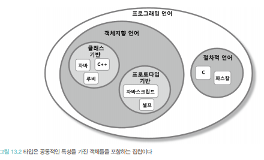

# 서브 클래싱과 서브타이핑
- 상속의 용도
1. 타입 계층을 구현한다.
    - 타입 계층 안에서 부모 클래스는 일반적인 개념을 구현하고 자식 클래스는 특수한 개념을 구현한다.
    - 타입 계층 의 관점에서 
      부모클래스는 자식 클래스의 일반화(generalization)이고, 
      자식 클래스는 부모 클래스의 특수화(specialization)이다.
      
      
2. 코드 재사용이다. 
    - 상속은 간단한 선언만으로 부모 클래스의 코드를 재사용할 수 있는 마법의 주문과도 같다. 
    상속을 사용하면 점진적으로 어플리케이션의 기능을 확장할 수 있다. 
      하지만 재사용을 위해 상속을 사용할 경우 부모클래스의 자식클래스가 강하게 결합기되 때문에 변경하기 어려운 코드를 얻게 될 확률이 높다.  
      
    - 상속을 사용하는 일차원적인 목표는 코드 재사용이 아니라 타입 계층을 구현하는 것이어야 한다. 
    상속은 코드를 재사용할 수 있는 방법을 제공하지만 부모 클래스와 자식 클래스를 강하게 결합시키기 때문에 설계의 변경과 진화를 방해한다.
    - 타입 계층을 목표로 상속을 사용하면 다형적으로 동작하는 객체들의 관계에 기반해 확장 가능하고 유연한 설계를 얻을 수 있다.  
    
- 결론은 동일한 메시지에 대해 서로 다르게 행동할 수 있는 다형적인 객체를 구현하기 위해서는 객체의 행동을 기반으로 타입계층을 구성해야 한다. 
상속의 가치는 이러한 타입 계층을 구현할 수 잇는 쉽고 편안한 방법을 제공한다는 데 있다.  
  타입 사이의 관계를 고려하지 않은 채 단순히 코드를 재사용하기 위해 상속을 해서는 안 된다.  
  
-  객체지향 프로그래밍과 객체 기반 프로그래밍
  - 객체기반 프로그래밍(Object-Based Programming)이란 상태와 행동을 캡슐화한 객체를 조합해서 프로그램을 구성하는 방식을 가리킨다. 
이 정의에 따르면 객체지향 프로그래밍(Object-Oriented Programming)역시 객체기반 프로그래밍의 한 종류다. 
  - 객체지향 프로그래밍은 객체기반 프로그래밍과 마찬가지로 객체들을 조합해서 어플리케이션을 개발하지만,
    <b>상속</b>과 <b> 다형성</b>을 지원한다는 점에서 객체기반을 프로그맹과 차별화된다.  간단히 말해서 객체지향 프로그래밍은 상속과 다형성을 지원하지만 객체지반 프로그래밍은 지원하지 않는다.  
    초기 버전의 비주얼 베이직(Visual Basic)의 경우 객체라는 개념은 존재하지만 클래스 사이의 상속 관계의 다형성은 지원하지 않았기 때문에 객체기반 프로그래밍 언어로 분류된다. 
    반면, C++, 자바, 루비, C# 등의 언어는 상속과 다형성을 지원하기 때문에 객체지향 프로그래밍 언어로 분류된다.  
    종종 객체기반 프로그래밍이 다른 의미로 사용되기 때문에 혼란을 초래하는 경우가 있다. 
    객체기반 프로그래밍이 자바스크립트와 같이 클래스가 존재하지 않는 <b>프로토타입 기반 언어 (Prototype-Based Language)를 사용한 프로그래밍 방식을 가리키게 위해 사용되는 경우가 바로 그것이다.
    이 관점에서 객체지향 프로그래밍이란 클래스를 사용하는 프로그래밍 방식을 의미하고 객체기반 프로그래밍이란 클래스 없이 오직 객체만을 사용하는 프로그래밍 방식을 가리킨다.  
    
## 01 타입
 ### 개념 관점의 타입
- 개념 관점에서 타입이란 우리가 인지하는 세상의 사물의 종류를 의미한다. 
다시 말해 우리가 인식하는 객체들에 적용하는 개념이나 아이디어를 가리켜 타입이라고 부른다. 
  타입은 사물을 분류하기 위한 틀로 사용된다. 
  예를 들어, 자바, 루비, 자바스크립트, C를 프로그래밍 언어라고 부를 때 우리는 이것들을 프로그래밍 언어라는 타입으로 분류하고 있는 것이다.  
자바, 루비 , 자바스크립트, C는 프로그래밍 언어의 인스턴스다. 일반적으로 타입의 인스턴스를 객체라고 부른다.
  
- 타입을 구성하는 세 가지 요소
  - 심볼 (Symbol)  : 타입에 이름을 붙인 것. ex) 프로그래밍 언어 
  - 내연(intension)이란 : 타입의 정의, 타입에 속하는 객체들이 가지는 공통적인 속성이나 행동을 가리킨다. 
    '프로그래밍 언어'의 정의인 '컴퓨터에게 특정한 작업을 지시하기 위한 어휘와 문법적 규칙의 집합' 
    일반적으로타입에 속하는 객체들이 공유하는 속성과 행동의 집합이 내연을 구성한다.
  - 외연(extension) : 타입에 속하는 객체들의 집합이다. 
    그로그래밍 언어 타입의 경우에는 자바,루비, 자바스크립트, C가 속한 집합이 외연을 구성한다.  
    
### 프로그래밍 언어 관점의 타입
- 프로그래밍 언어 관점 타입은 연속적인 비트에 의미와 제약을 부여하기 위해 사용.
- 하드웨어는 데이터를 0과 1로 구성된 일련의 비트조합으로 취급한다. 
하지만 비트 자체에는 타입이라는 개념이 존재하지 않는다. 
  비트에 담긴 데이터를 문자열로 다룰지, 정수로 다룰지는 전적으로 데이터를 사용하는 어플리케이션에 의해 결정된다.  
  따라서 프로그래밍 언어의 관점에서 타입은 비트 묶음에 의미를 부여하기 위해 정의된 제약과 규칙을 가리킨다.  
  
- 프로그래밍 언어에서 타입은 두 가지 목적으로 사용된다.  
 1. #### 타입에 수행될 수 있는 유효한 오퍼레이션의 집합을 정의한다. 
- 자바에서 '+'연산자는 원시형 숫자 타입이나 문자열 타입의 객체에는 사용할 수 있지만, 
다른클래스의 인스턴스에 대해서는 사용할 수 없다. 
  여기서 중요한 것은 모든 객체지향 언어들은 객체의 타입에 따라 적용 가능한 연산자의 종류를 제한함으로써는 프로그래머의 실수를 막아준다. 
  
  
2. #### 타입에 수행되는 오퍼레이션에 대해 미리 약속된 문맥을 제공한다. 
- 예를 들어 자바에서 a + b 라는 연산이 있을 때 a와 b의 타입이 int라면 두 수를 더할 것이다. 
하지만 a와 b의 타입이 String 이라면 두 문자열을 합칠 것이다. 
  따라서 a와 b에 부여된 타입이 '+' 연산자의 문맥을 정의한다. 비슷한 예로 자바와 C#의 new연산자는 타입에 정의된 크기만큼 저장 공간을 할당하고 
  생성된 객체를 초기화하기 위해 타입의 생성자를 자동으로 호출된다. 이 경우 객체를 생성하는 방법에 대한 문맥을 결정하는 것은 바로 객체의 타입이다.
  
  - 정리: 타입은 적용 가능한 오퍼레이션의 종류와 의미를 정의함으로써 코드의 의미를 명확하게 전달하고 개발자의 실수를 방지하기 위해 사용된다. 
    이제 타입의 개념을 객체지향 패러다임의 관점에서 확장해보자. 
    
### 객체짛야 패러다임 관전의 타임
- 지금까지의 내용을 바탕으로 타입을 다음과 같은 두 가지 관점에서 정의할 수 있다. 
  - 개념 관점에서 타입이란 공통의 특징을 공유하는 대상들의 분류다.
  - 프로그래밍 언어 관점에서 타입이란 동일한 오퍼레이션을 적용할 수 있는 인스턴스들의 집합이다.  
    
이제 이 두 정의를 객체지향 패러다임의 관점에서 조합해보자. 프로그래밍 언어의 관점에서 타입은 호출 가능한 오퍼레이션의 집합을 정의한다. 
객체지향 프로그래밍에서 오퍼레이션은 객체가 수신할 수 있는 메시지를 의미한다. 
따라서 객체의 타입이란 객체가 수신할 수 있는 메시지의 종류를 정의하는 것이다.  
우리는 이미 객체가 수신할 수 있는 메시지의 집합을 가리키는 멋진 용어를 알고 있다. 
바로 <b>퍼블릭 인터페이스</b>가 그것이다. 
객체지향 프로그래밍에서 타입을 정의하는 것은 객체의 퍼블릭 인터페이스를 정의하는 것과 동일하다.  
개념 관점에서 타입은 공통의 특성을 가진 객체들을 분류하기 위한 기준이다. 
그렇다면 그여기서 공통의 특성이란 무엇인가? 타입이 오퍼레이션을 정의한다는 사실을 기억하면 쉽게 답을 구할 수 있을 것이다. 
객체지향에서는 객체가 수신할 수 있는 메시지를 기준으로 타입을 분류하기 때문에 동일한 퍼블릭 인터페이스를 가지는 객체들을 동일한 타입으로 분류할 수 있다.  
객체지향 프로그래밍 관점에서 타입을 다음과 같이 정의할 수 있다.  
객체의 퍼블릭 인터페이스가 객체의 타입을 결정한다. 
따라서 동일한 퍼블릭 인터페이스를 제공하는 객체들은 동일한 타입으로 분류된다.  
타입의 정의는 지금까지 줄곧 강조해왔던 객체에 관한 한 가지 사실을 다시 한번 강조한다. 
객체에게 중요한 것은 속성은 아니라 행동이라는 사실이다. 
어떤 객체들이 동일한 상태를 가지고 있떠라도 퍼블릭 인터페이스가 다르다면 이들은 서로 다른 타입으로 분류된다. 
반대로 어떤 객체들이 내부 상태는 다르지만 동일한 퍼블릭 인터페이스를 공유한다면 이들은 동일한 타입으로 분류된다.  
객체를 바라볼 때는 항상 객체가 외부에 제공하는 행동에 초점을 맞춰야 한다.  
객체의 타입을 결정하는 것은 내부의 속성이 아니라 객체가 외부에 제공하는 해동이라는 사실을 기억하라. 

## 타입 계층
### 타입 사이의 포함관계
- 수학에서 집합은 다른 집합을 포함할 수 있다. 
타입 역시 객체들의 집합이기 때문에 다른 타입을 포함하는 것이 가능하다. 
  타입 안에 포함된 객체들을 좀 더 상세한 기준으로 묶어 새로운 타입을 정의하면 이 새로운 타입은 자연스럽게 기존 타입의 부분집합이 된다. 
  안에서 예로 든 자바, 루비, 자바스크립트, C는 '프로그래밍 언어' 타입의 인스턴스다.  
  따라서 이들을 그럼 13.1과 같이 '프로그래밍 언어' 집합의 원소로 표현할 수 있다.  
  
- 이 집합의 원소들을 좀 더 상세한 기준에 따라 분류할 수 있다. 
자바, 루비, 자바스크립트는 '객체지향언어'로 분류할 수 있고, C는 '절차적 언어'로 분류할 수 있다. 
  더 나아가 자바와 루비는 '클래스 기반 언어'로, 자바스크립트는 '프로토타입 기반 언어 '로 분류할 수 있다.  
  
그림 13.2에서 알 수 있는 것처럼 타입은 집합의 관점에서 더 세분화된 타입의 집합을 부분집합으로 포함할 수 있다. 
'프로그래밍 언어' 타입은 '객체지향 언어' 타입과 '절차적 언어' 타입을 포함하고, '객체지향 언어' 타입은 '클래스 기반 언어' 타입을 포함한다. 
  

타입이 다른 타입에 포함될 수 있기 때문에 동일한 인스턴스가 하나 이상의 타입으로 분류되는 것도 가능하다. 
자바는 '프로그래밍 언어' 인 동시에 '객체지향 언어' 에 속하며 더 세부적으로 '클래스 기반 언어' 타입에 속한다.  
다른 타입을 포함하는 타입은 포함되는 타입보다 더 많은 인스턴스를 가진다.  
그림 13.2에서 '프로그래밍 언어' 타입은 7개의 인스턴스를 포함하지만 '클래스 기반 언어' 타입은 이보다 적은 3개의 인스턴스만 포함한다.  
다시 말해서 포함되는 타입은 외연 고나점에서는 더 크고 내연관점에서는 더 일반적이다. 